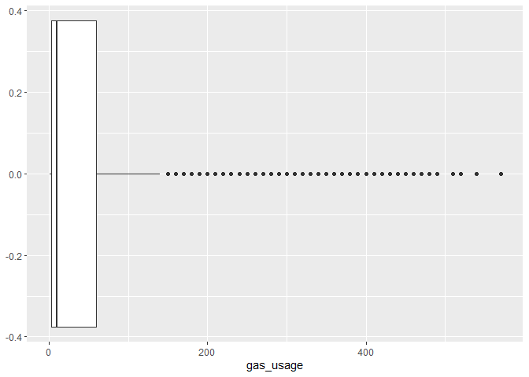
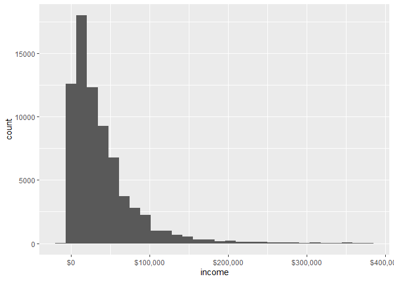
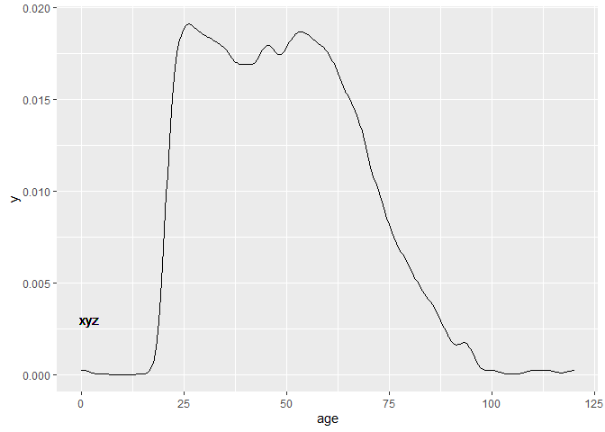
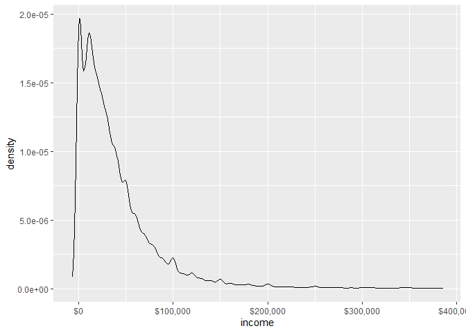
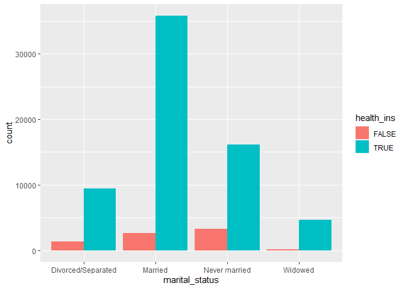
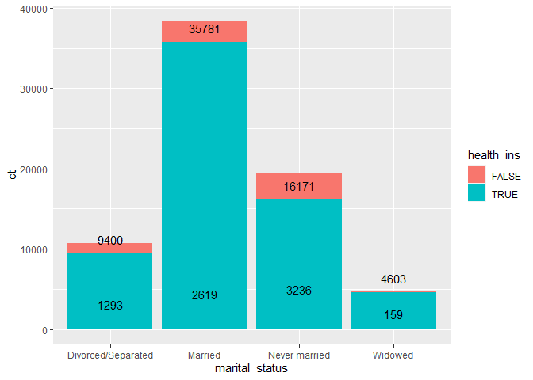
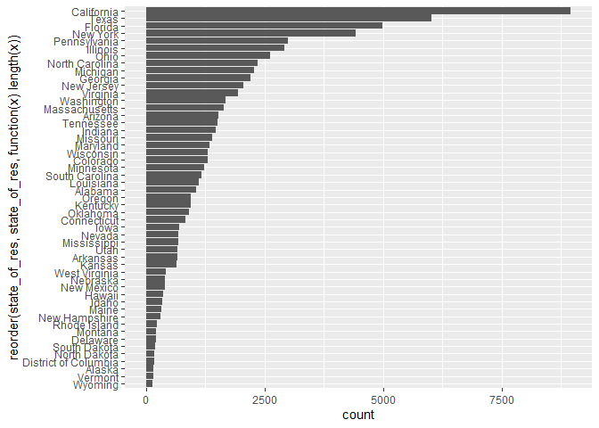
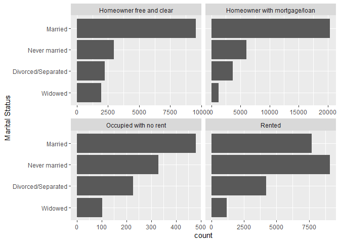
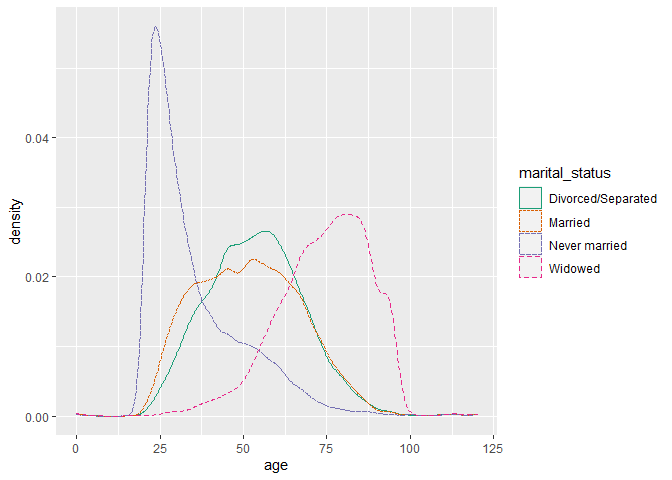
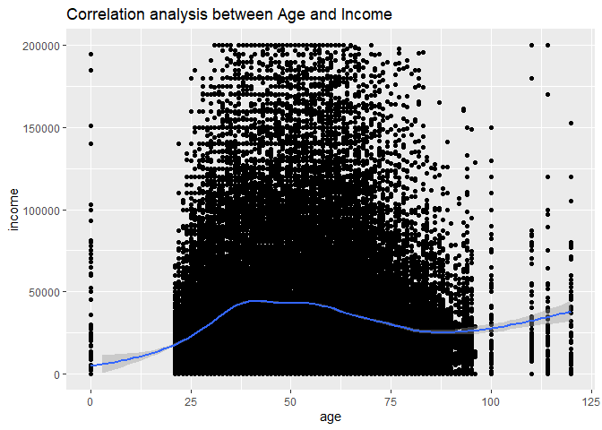

## Exploratory Data Analysis

#### Leaving the HTML - CSS styles in the document, just in case if it is required later.

<style>
p.blue_box {
  background-color: #4955a1;
  color: #FFFFFF;
  padding: 10px;
  border: 1px solid blue;
  margin-left: 25px;
  border-radius: 5px;
  font-style: normal;
}

p.heading {
  background-color: #a19549;
  margin: auto;
  width: 80%;
  padding: 5px;
  font-style: bold;
}

p.regular {
  margin: auto;
  padding: 5px;
}

</style>
<p class="blue_box">
Data Science projects begin with the problem at hand, and then we
examine the available data. The available data should now assist us in
addressing the problem. If the data itself is incorrect or insufficient,
we must take a pause and either begin collecting additional data, new
and relevant data, or an entirely new dataset in order to solve the
problem. To determine if the data at hand is accurate, we will begin
with descriptive statistics to determine the range of data values, mean,
median, etc., followed by exploratory data analysis to determine the
relationship between variables. Various techniques are employed during
this analysis, beginning with the creation of visualizations, data
cleansing to remove missing values, imputation of missing data with
meaningful and close estimates, etc.
</p>

<br>

<p class="heading">
<b>Problem statement: Who are the prospective customers from the
available dataset who do not have health insurance and who should be
contacted by our marketing team?</b>
</p>

</br>

<p class="regular">

For this analysis, the data is assumed to be stored in a single data
frame. But, generally, the data is spread across multiple tables in a
normalized fashion (We are talking about the database normalization).

The original dataset used for this exploratory analysis is available at
the “Practical Data Science with R” author’s primary [github
repository](https://github.com/WinVector/PDSwR2)
</p>

-   Pay special attention to the missing values in the summary

``` r
summary(customer_data)
```

    ##     custid              sex        is_employed         income       
    ##  Length:73262       Female:37837   Mode :logical   Min.   :  -6900  
    ##  Class :character   Male  :35425   FALSE:2351      1st Qu.:  10700  
    ##  Mode  :character                  TRUE :45137     Median :  26200  
    ##                                    NA's :25774     Mean   :  41764  
    ##                                                    3rd Qu.:  51700  
    ##                                                    Max.   :1257000  
    ##                                                                     
    ##             marital_status  health_ins     
    ##  Divorced/Separated:10693   Mode :logical  
    ##  Married           :38400   FALSE:7307     
    ##  Never married     :19407   TRUE :65955    
    ##  Widowed           : 4762                  
    ##                                            
    ##                                            
    ##                                            
    ##                        housing_type   recent_move      num_vehicles  
    ##  Homeowner free and clear    :16763   Mode :logical   Min.   :0.000  
    ##  Homeowner with mortgage/loan:31387   FALSE:62418     1st Qu.:1.000  
    ##  Occupied with no rent       : 1138   TRUE :9123      Median :2.000  
    ##  Rented                      :22254   NA's :1721      Mean   :2.066  
    ##  NA's                        : 1720                   3rd Qu.:3.000  
    ##                                                       Max.   :6.000  
    ##                                                       NA's   :1720   
    ##       age               state_of_res     gas_usage     
    ##  Min.   :  0.00   California  : 8962   Min.   :  1.00  
    ##  1st Qu.: 34.00   Texas       : 6026   1st Qu.:  3.00  
    ##  Median : 48.00   Florida     : 4979   Median : 10.00  
    ##  Mean   : 49.16   New York    : 4431   Mean   : 41.17  
    ##  3rd Qu.: 62.00   Pennsylvania: 2997   3rd Qu.: 60.00  
    ##  Max.   :120.00   Illinois    : 2925   Max.   :570.00  
    ##                   (Other)     :42942   NA's   :1720

``` r
temp <- c(1, NA, -3, 5)
is.na(temp)
```

    ## [1] FALSE  TRUE FALSE FALSE

-   Now looking at the columns that have huge variation, can we explore
    these columns for outliers?
-   For example, the mean value of gas_usage is 41 and the 3rd quartile
    has 60. However, there is a max value of 570. Do you think there are
    any outliers in the data?
-   Plot a boxplot and see the outliers?

``` r
library(ggplot2)
ggplot(customer_data) + 
  geom_boxplot(aes(x = gas_usage))
```

    ## Warning: Removed 1720 rows containing non-finite values (stat_boxplot).

<!-- -->

-   What is the spread of income? Is it normally spread? Draw a
    histogram.

``` r
ggplot(data=customer_data[customer_data[,"income"] <
                            min(sort(customer_data$income, decreasing = T)[1:500]), ]) + 
  geom_histogram(mapping = aes(x = income)) +
  lims(x = c(0,200000)) +
  scale_x_continuous(labels = scales::dollar_format())
```

    ## Scale for 'x' is already present. Adding another scale for 'x', which will
    ## replace the existing scale.

    ## `stat_bin()` using `bins = 30`. Pick better value with `binwidth`.

<!-- -->

-   Density plots are another method for analyzing the distribution of
    univariate data  
-   Use the density plot to examine the age range of the customers.

``` r
ggplot(customer_data) +
  geom_density(aes(x = age)) + 
  geom_text(aes(x = 2, y = 0.003), label = "xyz") 
```

<!-- -->

``` r
ggplot(data=customer_data[customer_data[,"income"] <
                            min(sort(customer_data$income, decreasing = T)[1:500]), ]) + 
  geom_density(mapping = aes(x = income)) +
  scale_x_continuous(labels = scales::dollar_format()) 
```

<!-- -->

-   Create a bar chart to present the count values of various
    marital_statuses  
-   Compare a stacked bar_plot against a side-by-side bar plot
-   It would have been nice if there are proportion values to present
    the bar plots. This can be easily done with the dplyr and tidyr
    functions

``` r
ggplot(customer_data) + 
  geom_bar(aes(x = marital_status, fill=health_ins), position="dodge") 
```

<!-- -->

-   We need count of each combination

``` r
health_ins_count_by_marital_status <- aggregate(sex~marital_status+as.factor(health_ins), 
                                                data = customer_data, length)
names(health_ins_count_by_marital_status) <- c("marital_status","health_ins", "ct")
```

``` r
ggplot(health_ins_count_by_marital_status, aes(x=marital_status, y = ct)) +
  geom_bar(aes(fill=health_ins), stat = "identity") +
  geom_text(aes(label = ct), vjust = -1)
```

<!-- -->

-   Create a bar chart to present the count values of various
    marital_statuses

``` r
ggplot(customer_data) + 
  geom_bar(aes(x = reorder(state_of_res, state_of_res, function(x) length(x)))) +
  #theme(axis.text.x = element_text(angle = 90))
  coord_flip()
```

<!-- -->

-   Compare marital status against housing type: Categorical
    vs. Categorical comparison
-   Facet plots with bar charts

``` r
ggplot(customer_data[!is.na(customer_data$housing_type),]) +
  geom_bar(aes(x = reorder(marital_status, marital_status, function(x) {length(x)}))) + 
  facet_wrap(~housing_type, scale = "free_x") +
  scale_x_discrete(name = "Marital Status") +
  coord_flip()
```

<!-- -->

-   Compare population densities across categories

``` r
ggplot(data = customer_data) +
  geom_density(aes(x = age, color = marital_status, linetype = marital_status, position="fill")) + 
  scale_color_brewer(palette="Dark2")
```

    ## Warning: Ignoring unknown aesthetics: position

<!-- -->

-   Scatter plots to identify relationships between two continuos
    variables.
-   Create a scatter plot between age and income to see if there is any
    relationship between them or they are just independent variables

``` r
ggplot(customer_data) + 
  geom_point(aes(x = age, y = income)) + 
  ggtitle(label = "Correlation analysis between Age and Income") + 
  geom_smooth(aes(x = age, y = income), method = "auto") + 
  lims(y = c(0, 200000))
```

    ## `geom_smooth()` using method = 'gam' and formula 'y ~ s(x, bs = "cs")'

    ## Warning: Removed 1471 rows containing non-finite values (stat_smooth).

    ## Warning: Removed 1471 rows containing missing values (geom_point).

<!-- -->

<p class="blue_box">
In summary, the two dimensional visualizations provide a great starting
point for exploratory data analysis. The below table summarizes
</p>

| Visualization          | Usage                                                                                                                                                                                                                                                                                 |
|------------------------|---------------------------------------------------------------------------------------------------------------------------------------------------------------------------------------------------------------------------------------------------------------------------------------|
| Line plot              | Shows the relationship between two continuous variables. Best when that relationship is functional, or nearly so.                                                                                                                                                                     |
| Scatter plot           | Shows the relationship between two continuous variables. Best when the relationship is too loose or cloud-like to be easily seen on a line plot.                                                                                                                                      |
| Smoothing curve        | Shows underly ing “average” relationship, or trend, between two continuous variables. Can also be used to show the relationship between a continuous and a binary or Boolean variable: the fraction of true values of the discrete variable as a function of the continuous variable. |
| Stacked bar chart      | Shows the relationship between two categorical variables (var1 and var2). Highlights the frequencies of each value of var1.                                                                                                                                                           |
| Side-by-side bar chart | Shows the relationship between two categorical variables (var1 and var2). Good for comparing the frequencies of each value of var2 across the values of var1. Works best when var2 is binary.                                                                                         |
| Filled bar chart       | Shows the relationship between two categorical variables (var1 and var2). Good for comparing the relative frequencies of each value of var2 within each value of var1. Works best when var2 is binary.                                                                                |

-   More into modeling issues later.
