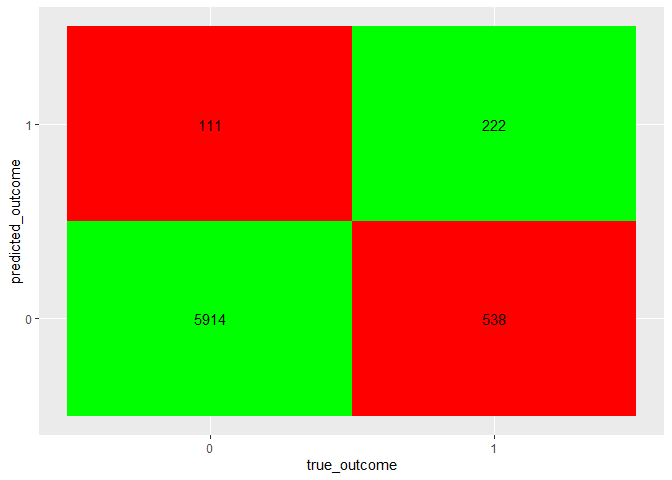

Classification using Logistic Regression
================
Naga Vemprala
2023-03-08

## Datascience problem -

#### The bank dataset contains 16 dimensions of customer information and one dependent variable indicating whether or not the customer opened a term deposit account. Now, it must be determined which customer is most likely to purchase a term deposit.

-   1.  Understanding the data is the initial step of any data science
        project. A summary of the data provides insight regarding any
        missing values, the range of values in a continuous variable,
        and the occurrence frequency of values for categorical data.  

-   Read the data and print summary statistics

``` r
bankData <- read.csv(paste0(getwd(),"/Datasets/bank/bank-full.csv"), sep = ";")
summary(bankData)
```

    ##       age            job              marital           education        
    ##  Min.   :18.00   Length:45211       Length:45211       Length:45211      
    ##  1st Qu.:33.00   Class :character   Class :character   Class :character  
    ##  Median :39.00   Mode  :character   Mode  :character   Mode  :character  
    ##  Mean   :40.94                                                           
    ##  3rd Qu.:48.00                                                           
    ##  Max.   :95.00                                                           
    ##    default             balance         housing              loan          
    ##  Length:45211       Min.   : -8019   Length:45211       Length:45211      
    ##  Class :character   1st Qu.:    72   Class :character   Class :character  
    ##  Mode  :character   Median :   448   Mode  :character   Mode  :character  
    ##                     Mean   :  1362                                        
    ##                     3rd Qu.:  1428                                        
    ##                     Max.   :102127                                        
    ##    contact               day           month              duration     
    ##  Length:45211       Min.   : 1.00   Length:45211       Min.   :   0.0  
    ##  Class :character   1st Qu.: 8.00   Class :character   1st Qu.: 103.0  
    ##  Mode  :character   Median :16.00   Mode  :character   Median : 180.0  
    ##                     Mean   :15.81                      Mean   : 258.2  
    ##                     3rd Qu.:21.00                      3rd Qu.: 319.0  
    ##                     Max.   :31.00                      Max.   :4918.0  
    ##     campaign          pdays          previous          poutcome        
    ##  Min.   : 1.000   Min.   : -1.0   Min.   :  0.0000   Length:45211      
    ##  1st Qu.: 1.000   1st Qu.: -1.0   1st Qu.:  0.0000   Class :character  
    ##  Median : 2.000   Median : -1.0   Median :  0.0000   Mode  :character  
    ##  Mean   : 2.764   Mean   : 40.2   Mean   :  0.5803                     
    ##  3rd Qu.: 3.000   3rd Qu.: -1.0   3rd Qu.:  0.0000                     
    ##  Max.   :63.000   Max.   :871.0   Max.   :275.0000                     
    ##       y            
    ##  Length:45211      
    ##  Class :character  
    ##  Mode  :character  
    ##                    
    ##                    
    ## 

-   From the above summary statistics, we can confirm that there are no
    missing values in any variable. There are 45,211 observations in the
    dataset. The output variable (DV) is a character value.

The output variable has only two possibilities and the frequency can be
displayed using the table function. However, the character output is not
suitable for regression analysis. Therefore, to fit the logistic
regression model, this output variable should be converted to a numeric
0 and 1 variable.

``` r
table(bankData$y)
```

    ## 
    ##    no   yes 
    ## 39922  5289

``` r
bankData$y <- ifelse(bankData$y == "yes", 1, 0)
```

-   Now it is time to explore other chatagorical variable to see what
    possible values exist for each of these variables.

``` r
cateorical_variables <- !sapply(bankData, is.numeric)
lapply(bankData[,cateorical_variables], table)
```

    ## $job
    ## 
    ##        admin.   blue-collar  entrepreneur     housemaid    management 
    ##          5171          9732          1487          1240          9458 
    ##       retired self-employed      services       student    technician 
    ##          2264          1579          4154           938          7597 
    ##    unemployed       unknown 
    ##          1303           288 
    ## 
    ## $marital
    ## 
    ## divorced  married   single 
    ##     5207    27214    12790 
    ## 
    ## $education
    ## 
    ##   primary secondary  tertiary   unknown 
    ##      6851     23202     13301      1857 
    ## 
    ## $default
    ## 
    ##    no   yes 
    ## 44396   815 
    ## 
    ## $housing
    ## 
    ##    no   yes 
    ## 20081 25130 
    ## 
    ## $loan
    ## 
    ##    no   yes 
    ## 37967  7244 
    ## 
    ## $contact
    ## 
    ##  cellular telephone   unknown 
    ##     29285      2906     13020 
    ## 
    ## $month
    ## 
    ##   apr   aug   dec   feb   jan   jul   jun   mar   may   nov   oct   sep 
    ##  2932  6247   214  2649  1403  6895  5341   477 13766  3970   738   579 
    ## 
    ## $poutcome
    ## 
    ## failure   other success unknown 
    ##    4901    1840    1511   36959

-   From the above frequency table, it appears that the greatest number
    of contacts were made in May, followed by July and June; therefore,
    they are all related to a single season and, in most cases, the
    month would not have influenced a person’s decision to purchase a
    term insurance policy.

Similar analogy applies to the column “day”, which would not impact the
outcome.

-   Running a logistic regression using raw data. We are not normalizing
    the continuous variables as well.  
-   To create a logistic regression model, we need a training sample to
    fit the model and a test sample to test the model fitness.  
-   Setting a seed to a constant value so that the results could be
    reproducible (However, the reproducibility depends on the R version)

``` r
set.seed(1234)
train_test_ind <- sample(c("for_fit", "for_test"), nrow(bankData), 
                         replace = T, prob = c(0.85, 0.15))
train <- bankData[train_test_ind == "for_fit",]
test <- bankData[train_test_ind == "for_test",]
```

-   Using the train dataset fit a logistic regression

``` r
cat_model_logit <- glm(y ~., 
                       data = train[!colnames(bankData) %in% c("day", "month")],
                       family = "binomial")
summary(cat_model_logit)
```

    ## 
    ## Call:
    ## glm(formula = y ~ ., family = "binomial", data = train[!colnames(bankData) %in% 
    ##     c("day", "month")])
    ## 
    ## Deviance Residuals: 
    ##     Min       1Q   Median       3Q      Max  
    ## -5.6066  -0.4104  -0.2761  -0.1626   3.5025  
    ## 
    ## Coefficients:
    ##                      Estimate Std. Error z value Pr(>|z|)    
    ## (Intercept)        -2.425e+00  1.788e-01 -13.566  < 2e-16 ***
    ## age                 5.087e-04  2.314e-03   0.220 0.825983    
    ## jobblue-collar     -3.817e-01  7.647e-02  -4.991 6.00e-07 ***
    ## jobentrepreneur    -4.403e-01  1.317e-01  -3.343 0.000828 ***
    ## jobhousemaid       -5.256e-01  1.416e-01  -3.712 0.000206 ***
    ## jobmanagement      -2.236e-01  7.720e-02  -2.897 0.003772 ** 
    ## jobretired          3.145e-01  1.013e-01   3.106 0.001894 ** 
    ## jobself-employed   -3.716e-01  1.179e-01  -3.153 0.001616 ** 
    ## jobservices        -3.288e-01  8.853e-02  -3.714 0.000204 ***
    ## jobstudent          4.648e-01  1.144e-01   4.065 4.81e-05 ***
    ## jobtechnician      -3.057e-01  7.245e-02  -4.220 2.45e-05 ***
    ## jobunemployed      -2.413e-01  1.186e-01  -2.035 0.041868 *  
    ## jobunknown         -3.745e-01  2.437e-01  -1.537 0.124324    
    ## maritalmarried     -1.702e-01  6.194e-02  -2.748 0.006000 ** 
    ## maritalsingle       1.419e-01  7.052e-02   2.013 0.044163 *  
    ## educationsecondary  1.362e-01  6.825e-02   1.996 0.045987 *  
    ## educationtertiary   3.644e-01  7.955e-02   4.580 4.65e-06 ***
    ## educationunknown    2.870e-01  1.084e-01   2.648 0.008098 ** 
    ## defaultyes         -3.552e-01  1.859e-01  -1.911 0.055989 .  
    ## balance             1.617e-05  5.267e-06   3.071 0.002134 ** 
    ## housingyes         -7.731e-01  4.265e-02 -18.126  < 2e-16 ***
    ## loanyes            -5.387e-01  6.222e-02  -8.659  < 2e-16 ***
    ## contacttelephone   -8.813e-02  7.816e-02  -1.128 0.259507    
    ## contactunknown     -1.198e+00  6.300e-02 -19.012  < 2e-16 ***
    ## duration            3.930e-03  6.664e-05  58.980  < 2e-16 ***
    ## campaign           -1.086e-01  1.059e-02 -10.253  < 2e-16 ***
    ## pdays               1.741e-04  3.228e-04   0.539 0.589569    
    ## previous            8.825e-03  6.290e-03   1.403 0.160643    
    ## poutcomeother       2.582e-01  9.289e-02   2.780 0.005434 ** 
    ## poutcomesuccess     2.316e+00  8.545e-02  27.099  < 2e-16 ***
    ## poutcomeunknown    -2.428e-01  9.670e-02  -2.511 0.012055 *  
    ## ---
    ## Signif. codes:  0 '***' 0.001 '**' 0.01 '*' 0.05 '.' 0.1 ' ' 1
    ## 
    ## (Dispersion parameter for binomial family taken to be 1)
    ## 
    ##     Null deviance: 27870  on 38425  degrees of freedom
    ## Residual deviance: 19409  on 38395  degrees of freedom
    ## AIC: 19471
    ## 
    ## Number of Fisher Scoring iterations: 6

-   Let’s pick a single variable, education, to understand the model
    coefficients. Education has four possible values: primary,
    secondary, tertiary, and unknown.
-   Since those with a tertiary education are expected to have higher
    salary ranges, we can hypothesize that the likelihood of purchasing
    a term deposit increases from primary to secondary to tertiary
    education.

Looking at the coefficients:  
- educationsecondary 1.362e-01 6.825e-02 1.996 0.045987 \*  
- educationtertiary 3.644e-01 7.955e-02 4.580 4.65e-06 \*\*\*  
- educationunknown 2.870e-01 1.084e-01 2.648 0.008098 \*\*

Primary education status is taken as base (As the variable name is not
appearing here). However, do we really need to consider “primary”
education as base? If not, we need to relevel the variables. We will do
it later. First, lets check the log-odds. - Log-odds are easy to
interpret while considering a logistic regression.

``` r
log_odds <- exp(cat_model_logit$coefficients)
log_odds
```

    ##        (Intercept)                age     jobblue-collar    jobentrepreneur 
    ##         0.08847352         1.00050879         0.68270790         0.64381468 
    ##       jobhousemaid      jobmanagement         jobretired   jobself-employed 
    ##         0.59117118         0.79962157         1.36963102         0.68962779 
    ##        jobservices         jobstudent      jobtechnician      jobunemployed 
    ##         0.71978755         1.59168289         0.73658600         0.78558455 
    ##         jobunknown     maritalmarried      maritalsingle educationsecondary 
    ##         0.68761717         0.84349454         1.15248072         1.14590976 
    ##  educationtertiary   educationunknown         defaultyes            balance 
    ##         1.43959377         1.33238807         0.70102674         1.00001617 
    ##         housingyes            loanyes   contacttelephone     contactunknown 
    ##         0.46159478         0.58348187         0.91564565         0.30188597 
    ##           duration           campaign              pdays           previous 
    ##         1.00393822         0.89712286         1.00017414         1.00886373 
    ##      poutcomeother    poutcomesuccess    poutcomeunknown 
    ##         1.29464773        10.13106641         0.78444951

Taking the log-odds of these coefficients, we get:

| **educationsecondary** | **educationtertiary** | **educationunknown** |
|------------------------|-----------------------|----------------------|
| 1.14590976             | 1.43959377            | 1.33238807           |

The logistic regression model uses primary education as its baseline. If
a person has a secondary education (higher than a primary education),
the probability of that person taking out a term deposit is greater than
100 percent and is a factor of 1.14590976 or 114.6%. This factor or
ratio value of 1.14590976 is called the odds ratio. The odds ratio is
the ratio of the probability of an event occurring to the probability of
the event not occurring. If the probability of an event occurring
exceeds the probability of the event not occurring, then the ratio
exceeds 1.

-   Next we will create factor variables to correctly represent these
    categorical values.

-   Do we need to be accurate with the levels. The answer is “No”. Model
    will take care of it and our final significance values do not change
    with the change in the level values.

-   job: Hierarchy –\> unknown \< unemployed \< housemaid \< retired \<
    student \< blue-collar \< admin. \< technician \< services \<
    management \< self-employed \< entrepreneur

-   marital: Hierarchy –\> single \< married \< divorced

-   education: Hierarchy –\> unknown \< primary \< secondary \< tertiary

-   Has credit in default? No is better

-   default: Hierarchy –\> yes \< no

-   Has housing loan? Maybe having a loan makes someone more
    responsible.

-   housing: Hierarchy –\> no \< yes

-   Has housing loan? Maybe having a loan makes someone more
    responsible.

-   loan: Hierarchy –\> no \< yes

-   How did the marketing team reached out to the individuals for taking
    term deposit?

-   contact: Hierarchy –\> unknown \< telephone \< cellular

-   What was the previous outcome on other campaigns. This variable
    could provide information about how easy it to convince a customer

-   poutcome: Hierarchy –\> \> failure \< unknown \< other \< success

``` r
bankData$job <- factor(bankData$job, levels = c("unknown" , "unemployed" , "housemaid" , "retired" , "student" , "blue-collar" , "admin." , "technician" , "services" , "management" , "self-employed" , "entrepreneur"))

bankData$marital <- factor(bankData$marital, levels = c("single" , "married" , "divorced"))

bankData$education <- factor(bankData$education, levels = c("unknown" , "primary" , "secondary" , "tertiary"))

bankData$default <- factor(bankData$default, levels = c("yes", "no"))

bankData$housing <- factor(bankData$housing, levels = c("no", "yes"))

bankData$loan <- factor(bankData$loan, levels = c("no", "yes"))

bankData$contact <- factor(bankData$contact, levels = c("unknown", "telephone", "cellular"))

bankData$poutcome <- factor(bankData$poutcome, levels = c("failure", "unknown", "other", "success"))
```

-   Lets retrain the model and look at the coefficients.

``` r
train <- bankData[train_test_ind == "for_fit",]
test <- bankData[train_test_ind == "for_test",]
cat_model_logit <- glm(y ~., 
                       data = train[!colnames(bankData) %in% c("day", "month")],
                       family = "binomial")
log_odds <- exp(cat_model_logit$coefficients)
log_odds
```

    ##        (Intercept)                age      jobunemployed       jobhousemaid 
    ##         0.01976979         1.00050879         1.14247372         0.85973883 
    ##         jobretired         jobstudent     jobblue-collar          jobadmin. 
    ##         1.99185110         2.31478059         0.99286046         1.45429759 
    ##      jobtechnician        jobservices      jobmanagement   jobself-employed 
    ##         1.07121525         1.04678531         1.16288772         1.00292403 
    ##    jobentrepreneur     maritalmarried    maritaldivorced   educationprimary 
    ##         0.93629814         0.73189471         0.86769347         0.75053209 
    ## educationsecondary  educationtertiary          defaultno            balance 
    ##         0.86004205         1.08046132         1.42647911         1.00001617 
    ##         housingyes            loanyes   contacttelephone    contactcellular 
    ##         0.46159478         0.58348187         3.03308449         3.31250904 
    ##           duration           campaign              pdays           previous 
    ##         1.00393822         0.89712286         1.00017414         1.00886373 
    ##    poutcomeunknown      poutcomeother    poutcomesuccess 
    ##         0.78444951         1.29464773        10.13106641

-   This time lets analyze another variable, marital status.
-   The log odds ratios are:

| **maritalmarried** | **maritaldivorced** |
|--------------------|---------------------|
| 0.73189471         | 0.86769347          |

Being married has less probability of taking a term deposit when
compared to single individuals. Same thing with the divorced
individuals. Singles are more probable to take term deposit than the
divorced individuals as the factor is less than 1.

-   Now it is time to make predictions.
-   First, we will start with making predictions on training dataset, to
    see how well did we fit the logistic regression model. The overall
    significance of the model and the model parameters alone are not
    sufficient for evaluating the model fit. We need to make predictions
    with greater accuracy.

``` r
predict_training_outcome <- predict(cat_model_logit, 
                                    train[!colnames(bankData) %in% c("day", "month")], 
                                    type = "response")
# The predicted outcome is between 0 and 1. If the value is greater than 0.5, it can be considered as 1
predict_training_outcome <- ifelse(predict_training_outcome > 0.5, 1, 0)

# Get the accuracy using the training sample 
# First create a confusion matrix or contingency table 
confusionMatrix <- table(train$y, predict_training_outcome)
confusionMatrix <- as.data.frame(confusionMatrix) 
colnames(confusionMatrix) <- c("true_outcome", 
                               "predicted_outcome", 
                               "frequency")
accuracy <- sum(confusionMatrix[
  confusionMatrix$true_outcome == confusionMatrix$predicted_outcome, "frequency"]) /
  sum(confusionMatrix$frequency)
accuracy
```

    ## [1] 0.8995992

-   An accuracy of 90% using training sample is good. However, it has to
    be consistent with the test sample as well.
-   Capture the accuracy on the test sample.
-   However, the glm model need not be fit again. The fitted model is to
    be tested using the test sample

``` r
predict_test_outcome <- predict(cat_model_logit, 
                                    test[!colnames(bankData) %in% c("day", "month")], 
                                    type = "response")
# The predicted outcome is between 0 and 1. If the value is greater than 0.5, it can be considered as 1
predict_test_outcome <- ifelse(predict_test_outcome > 0.5, 1, 0)

# Get the accuracy using the training sample 
# First create a confusion matrix or contingency table 
confusionMatrix <- table(test$y, predict_test_outcome)
confusionMatrix <- as.data.frame(confusionMatrix) 
colnames(confusionMatrix) <- c("true_outcome", 
                               "predicted_outcome", 
                               "frequency")
accuracy <- sum(confusionMatrix[
  confusionMatrix$true_outcome == confusionMatrix$predicted_outcome, "frequency"]) /
  sum(confusionMatrix$frequency)
accuracy
```

    ## [1] 0.9043478

-   Finally, create a visual representation of the confusion matrix
    (special type of contingency table)

``` r
library(ggplot2) 
ggplot(data = confusionMatrix, mapping = aes(x = true_outcome, y = predicted_outcome)) + 
  geom_tile(fill=c("green", "red", "red", "green")
            ) +
  geom_text(aes(label = frequency))
```

<!-- -->
