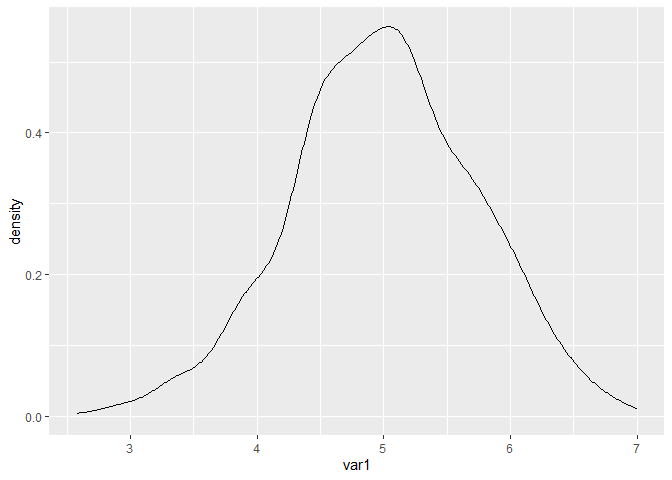
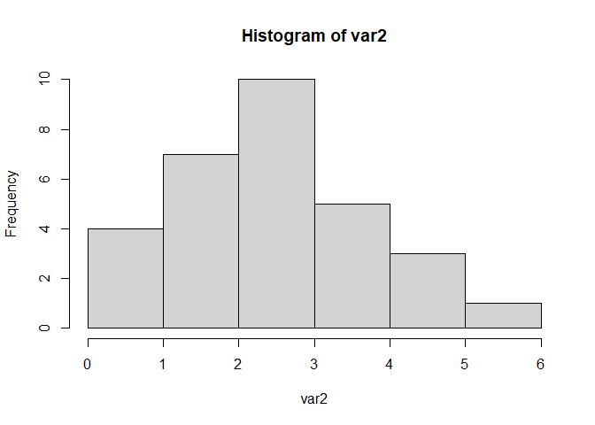
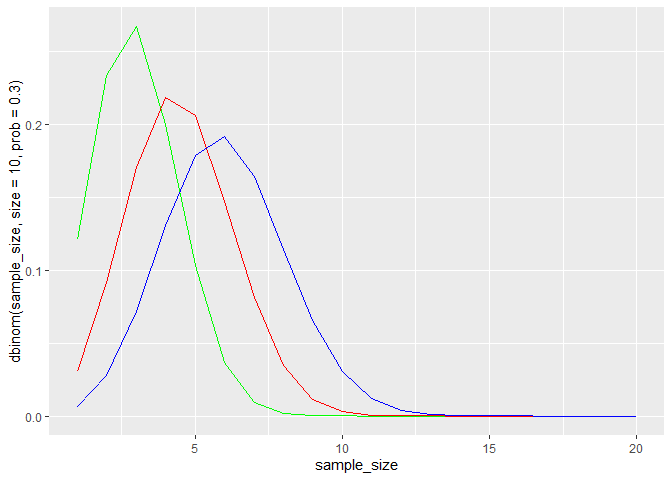
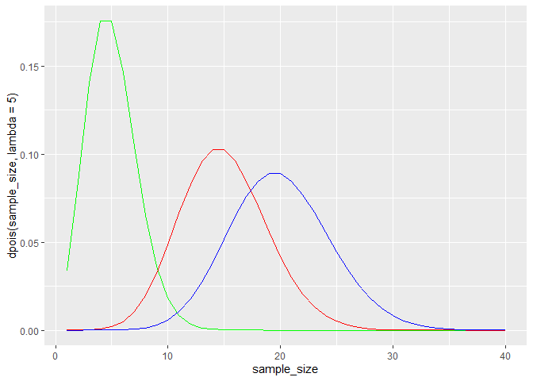
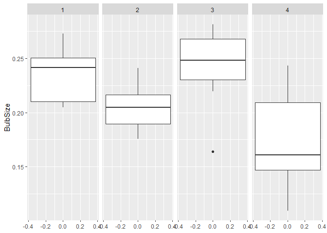
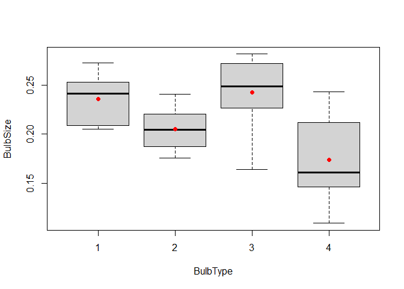
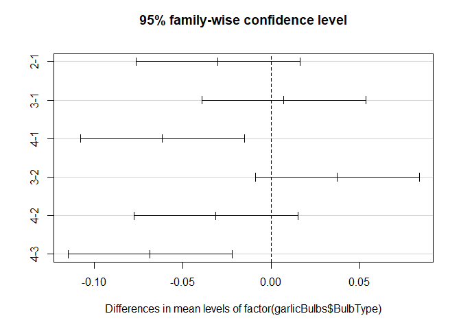

Probability, ANOVA and Regression
================
Naga Vemprala
2023-03-17

## Probability distributions

- Some of the code snippets are taken from the “R Cookbook” textbook,
  chapter 8.

- r<distribution name>

- rnorm()

- dnorm() \# Y-axis  

- pnorm()

- qnorm() \# x-axis

``` r
var1 <- rnorm(10)
print("Random 10 normally distributed values with mean 0 and sd 1: ")
```

    ## [1] "Random 10 normally distributed values with mean 0 and sd 1: "

``` r
print(var1)
```

    ##  [1]  1.47078870  0.75001463  1.91006320 -1.24774595  0.08457045  1.68347816
    ##  [7]  0.03842966 -2.05954177 -1.11877898 -0.36891885

``` r
var1 <- rnorm(10, mean = 5, sd = 0.75) 
print("Random 10 normally distributed values with mean 5 and sd 0.75: ")
```

    ## [1] "Random 10 normally distributed values with mean 5 and sd 0.75: "

``` r
print(var1)
```

    ##  [1] 5.023280 5.693898 4.371195 4.480612 5.462589 5.933298 5.093711 5.370273
    ##  [9] 5.445205 6.389281

``` r
# The below function should return highest density.
print(dnorm(5, mean = 5, sd = 0.75))
```

    ## [1] 0.531923

``` r
# Relatively less densest point than the point with value of 5. 
print(dnorm(4, mean = 5, sd = 0.75))
```

    ## [1] 0.2186801

``` r
# dnorm returns the y-axis value. 
var1 <- rnorm(1000, mean = 5, sd = 0.75) 
library(ggplot2)
ggplot(as.data.frame(var1)) + 
    geom_density(aes(x = var1))
```

<!-- -->

``` r
# qnorm x-axis value at a particular proportion 
qnorm(0.4, mean = 5, sd = 0.75)
```

    ## [1] 4.80999

``` r
# What percentage of values are less than a given input value from a normal distribution with a mean of 5 and sd of 0.75
print(pnorm(3, mean = 5, sd = 0.75)) # This proportion value should be small as the sd is small 
```

    ## [1] 0.003830381

``` r
print(pnorm(3, mean = 5, sd = 1.5)) # This proportion value should be larger the previous one because the sd is greater than 0.75
```

    ## [1] 0.09121122

``` r
# create a random binomial distribution of 30 elements with size of 10 and probability of success is 0.3
var2 <- rbinom(30, size = 10, prob = 0.3)
#print(var2)
hist(var2)
```

<!-- -->

``` r
# What is the density of having 6 wins out of 10 trials (60% win in a given sample) with a win - rate of 30% 
dbinom(6, size = 10, prob = 0.3) # This should be a small value 
```

    ## [1] 0.03675691

``` r
# What is the density of having 3 wins out of 10 trials (30% win in a given sample) with a win - rate of 30% 
dbinom(3, size = 10, prob = 0.3) # This should be a higher value than the previous density function. Because 3 out of 10 successes should be expected to be high from a binomial distribution with success rate of 30% out of 10 trials size. 
```

    ## [1] 0.2668279

``` r
qbinom(0.5, size = 10, prob = 0.3)
```

    ## [1] 3

``` r
# Binomial distributions with varying trial sizes 
sample_size <- 1:20
ggplot(data = as.data.frame(sample_size)) + 
    geom_line(aes(x = sample_size, y = dbinom(sample_size, size = 10, prob = 0.3)), color = "green") + 
    geom_line(aes(x = sample_size, y = dbinom(sample_size, size = 15, prob = 0.3)), color = "red") + 
    geom_line(aes(x = sample_size, y = dbinom(sample_size, size = 20, prob = 0.3)), color = "blue") 
```

<!-- -->
\#### The Poisson distribution is a probability distribution that is
used to model the probability that a certain number of events occur
during a fixed time interval when the events are known to occur
independently and with a constant mean rate.

For example, suppose a given call center receives 10 calls per hour. We
can use a Poisson distribution calculator to find the probability that a
call center receives 0, 1, 2, 3 … calls in a given hour:

- P(X = 0 calls) = 0.00005
- P(X = 1 call) = 0.00045
- P(X = 2 calls) = 0.00227
- P(X = 3 calls) = 0.00757

**Reference:**[Poisson
Distribution](https://www.statology.org/poisson-distribution-real-life-examples/)

``` r
# 
var3 <- rpois(12, 3)
var3
```

    ##  [1] 1 5 2 2 2 4 3 2 5 7 5 2

``` r
print(dpois(5, lambda = 3)) # This should be a small value 
```

    ## [1] 0.1008188

``` r
print(dpois(4, lambda = 3)) # A higher density value should return than the previous one 
```

    ## [1] 0.1680314

``` r
print(dpois(3, lambda = 3)) # exactly equal to 3, therefore, this is the highest density point. 
```

    ## [1] 0.2240418

``` r
# Increase the lamdba, the poisson distribution should approach a normal distribution 

sample_size <- 1:40
ggplot(data = as.data.frame(sample_size)) + 
    geom_line(aes(x = sample_size, y = dpois(sample_size, lambda = 5)), color = "green") + 
    geom_line(aes(x = sample_size, y = dpois(sample_size, lambda = 15)), color = "red") + 
    geom_line(aes(x = sample_size, y = dpois(sample_size, lambda = 20)), color = "blue")
```

<!-- -->

## ANOVA - Analysis of Variance

Analysis of variance (ANOVA) is a collection of statistical models and
their associated estimation procedures (such as the “variation” among
and between groups) used to analyze the differences among means.

- Is there a significant difference between the average sizes of garlic
  bulbs treated with four distinct fertilizers?

``` r
garlicBulbs <- read.csv(paste0(getwd(), "/Datasets/GarlicBulbSizes.csv"))
ggplot(data = garlicBulbs) + 
    geom_boxplot(aes(x = BulbSize)) +
    facet_grid(~BulbType) + 
    coord_flip()
```

<!-- -->

``` r
groupMeans <- sapply(split(garlicBulbs$BulbSize, garlicBulbs$BulbType), 
                     mean)
boxplot(BulbSize ~ BulbType, data = garlicBulbs) 
points(groupMeans, col = "red", pch = 16)
```

<!-- -->

``` r
anovaModel <- oneway.test(garlicBulbs$BulbSize ~ garlicBulbs$BulbType)
anovaModel
```

    ## 
    ##  One-way analysis of means (not assuming equal variances)
    ## 
    ## data:  garlicBulbs$BulbSize and garlicBulbs$BulbType
    ## F = 5.3593, num df = 3.000, denom df = 15.089, p-value = 0.01032

``` r
anovaModel <- aov(garlicBulbs$BulbSize ~ factor(garlicBulbs$BulbType))
plot(TukeyHSD(anovaModel))
```

<!-- -->

#### Manually calculate the F- Statistic

F = SSB / SSW

``` r
SSW <- function(x, mean_x) {
    sum( (x-mean_x)^2)
}

withInGroupVariation <- sum(mapply(FUN=SSW,
                                   split(garlicBulbs$BulbSize, garlicBulbs$BulbType),
                                   groupMeans))
withInGroupVariation <- withInGroupVariation/28 # Correcting it for degrees of freedom
betweenGroupVariation <- sum( 8 * (groupMeans - mean(garlicBulbs$BulbSize) )^2 ) 
betweenGroupVariation <- betweenGroupVariation / 3 # Correcting it for degrees of freedom 
F_statistic <- betweenGroupVariation / withInGroupVariation
p_value <- 1 - pf(F_statistic, 28, 3)
print(paste("F_statistic:", F_statistic, "& ", "p_value:", p_value))
```

    ## [1] "F_statistic: 6.85044919108543 &  p_value: 0.068601128939748"

#### Regression analysis

``` r
carSales <- read.csv(paste0(getwd(), "/Datasets/Car_sales.csv"))
summary(carSales)
```

    ##  Sales_in_thousands  Resale_value   Vehicle_type       Price_in_thousands
    ##  Min.   :  0.11     Min.   : 5.16   Length:157         Min.   : 9.235    
    ##  1st Qu.: 14.11     1st Qu.:11.26   Class :character   1st Qu.:18.017    
    ##  Median : 29.45     Median :14.18   Mode  :character   Median :22.799    
    ##  Mean   : 53.00     Mean   :18.07                      Mean   :27.391    
    ##  3rd Qu.: 67.96     3rd Qu.:19.88                      3rd Qu.:31.948    
    ##  Max.   :540.56     Max.   :67.55                      Max.   :85.500    
    ##                     NA's   :36                         NA's   :2         
    ##   Engine_size      Horsepower      Wheelbase         Width      
    ##  Min.   :1.000   Min.   : 55.0   Min.   : 92.6   Min.   :62.60  
    ##  1st Qu.:2.300   1st Qu.:149.5   1st Qu.:103.0   1st Qu.:68.40  
    ##  Median :3.000   Median :177.5   Median :107.0   Median :70.55  
    ##  Mean   :3.061   Mean   :185.9   Mean   :107.5   Mean   :71.15  
    ##  3rd Qu.:3.575   3rd Qu.:215.0   3rd Qu.:112.2   3rd Qu.:73.42  
    ##  Max.   :8.000   Max.   :450.0   Max.   :138.7   Max.   :79.90  
    ##  NA's   :1       NA's   :1       NA's   :1       NA's   :1      
    ##      Length       Curb_weight    Fuel_capacity   Fuel_efficiency
    ##  Min.   :149.4   Min.   :1.895   Min.   :10.30   Min.   :15.00  
    ##  1st Qu.:177.6   1st Qu.:2.971   1st Qu.:15.80   1st Qu.:21.00  
    ##  Median :187.9   Median :3.342   Median :17.20   Median :24.00  
    ##  Mean   :187.3   Mean   :3.378   Mean   :17.95   Mean   :23.84  
    ##  3rd Qu.:196.1   3rd Qu.:3.800   3rd Qu.:19.57   3rd Qu.:26.00  
    ##  Max.   :224.5   Max.   :5.572   Max.   :32.00   Max.   :45.00  
    ##  NA's   :1       NA's   :2       NA's   :1       NA's   :3      
    ##  Power_perf_factor
    ##  Min.   : 23.28   
    ##  1st Qu.: 60.41   
    ##  Median : 72.03   
    ##  Mean   : 77.04   
    ##  3rd Qu.: 89.41   
    ##  Max.   :188.14   
    ##  NA's   :2

``` r
carSales <- carSales[, -3]
```

``` r
# Replace NA values with the means 
imputeMeans <- function(x) {
    ifelse(is.na(x), mean(x, na.rm = T), x)
}

carSales <- as.data.frame(sapply(carSales, imputeMeans))
summary(carSales)
```

    ##  Sales_in_thousands  Resale_value   Price_in_thousands  Engine_size   
    ##  Min.   :  0.11     Min.   : 5.16   Min.   : 9.235     Min.   :1.000  
    ##  1st Qu.: 14.11     1st Qu.:12.54   1st Qu.:18.145     1st Qu.:2.300  
    ##  Median : 29.45     Median :17.71   Median :23.400     Median :3.000  
    ##  Mean   : 53.00     Mean   :18.07   Mean   :27.391     Mean   :3.061  
    ##  3rd Qu.: 67.96     3rd Qu.:18.14   3rd Qu.:31.930     3rd Qu.:3.500  
    ##  Max.   :540.56     Max.   :67.55   Max.   :85.500     Max.   :8.000  
    ##    Horsepower      Wheelbase         Width           Length     
    ##  Min.   : 55.0   Min.   : 92.6   Min.   :62.60   Min.   :149.4  
    ##  1st Qu.:150.0   1st Qu.:103.0   1st Qu.:68.40   1st Qu.:177.6  
    ##  Median :180.0   Median :107.0   Median :70.60   Median :187.8  
    ##  Mean   :185.9   Mean   :107.5   Mean   :71.15   Mean   :187.3  
    ##  3rd Qu.:215.0   3rd Qu.:112.2   3rd Qu.:73.40   3rd Qu.:196.1  
    ##  Max.   :450.0   Max.   :138.7   Max.   :79.90   Max.   :224.5  
    ##   Curb_weight    Fuel_capacity   Fuel_efficiency Power_perf_factor
    ##  Min.   :1.895   Min.   :10.30   Min.   :15.00   Min.   : 23.28   
    ##  1st Qu.:2.975   1st Qu.:15.80   1st Qu.:21.00   1st Qu.: 60.73   
    ##  Median :3.368   Median :17.20   Median :24.00   Median : 72.29   
    ##  Mean   :3.378   Mean   :17.95   Mean   :23.84   Mean   : 77.04   
    ##  3rd Qu.:3.778   3rd Qu.:19.50   3rd Qu.:26.00   3rd Qu.: 89.40   
    ##  Max.   :5.572   Max.   :32.00   Max.   :45.00   Max.   :188.14

``` r
correlation_matrix <- as.data.frame(cor(carSales))
```

``` r
carsales_model <- lm(Price_in_thousands ~ . , data = carSales)
summary(carsales_model)
```

    ## 
    ## Call:
    ## lm(formula = Price_in_thousands ~ ., data = carSales)
    ## 
    ## Residuals:
    ##     Min      1Q  Median      3Q     Max 
    ## -2.8187 -0.8509 -0.2118  0.4234 24.8676 
    ## 
    ## Coefficients:
    ##                     Estimate Std. Error t value Pr(>|t|)    
    ## (Intercept)        -1.963969   6.579387  -0.299  0.76575    
    ## Sales_in_thousands -0.002139   0.003533  -0.605  0.54584    
    ## Resale_value        0.115321   0.036679   3.144  0.00202 ** 
    ## Engine_size        -1.210807   0.477745  -2.534  0.01232 *  
    ## Horsepower         -0.648834   0.034312 -18.910  < 2e-16 ***
    ## Wheelbase           0.011516   0.058563   0.197  0.84438    
    ## Width              -0.105120   0.101892  -1.032  0.30394    
    ## Length             -0.037419   0.031435  -1.190  0.23584    
    ## Curb_weight         2.573305   0.848156   3.034  0.00286 ** 
    ## Fuel_capacity      -0.001394   0.116240  -0.012  0.99045    
    ## Fuel_efficiency     0.196395   0.094757   2.073  0.03998 *  
    ## Power_perf_factor   1.968250   0.081177  24.246  < 2e-16 ***
    ## ---
    ## Signif. codes:  0 '***' 0.001 '**' 0.01 '*' 0.05 '.' 0.1 ' ' 1
    ## 
    ## Residual standard error: 2.489 on 145 degrees of freedom
    ## Multiple R-squared:  0.9717, Adjusted R-squared:  0.9695 
    ## F-statistic: 452.2 on 11 and 145 DF,  p-value: < 2.2e-16

#### Analyzing models using the AIC - Maximum Likelihood estimation

- Refer R Cookbook for forward pass and backward pass model selection.

``` r
min.model <- lm(Price_in_thousands ~ 1, data=carSales)
fwd.model <- step(min.model, 
                  direction = "forward", 
                  scope = (Price_in_thousands ~ Sales_in_thousands + 
                    Resale_value        + 
                    Engine_size        +
                    Horsepower         +
                    Wheelbase           +
                    Width              +
                    Length             +
                    Curb_weight         +
                    Fuel_capacity      +
                    Fuel_efficiency     +
                    Power_perf_factor)
)
```

    ## Start:  AIC=835.42
    ## Price_in_thousands ~ 1
    ## 
    ##                      Df Sum of Sq   RSS    AIC
    ## + Power_perf_factor   1   25575.5  6144 579.71
    ## + Horsepower          1   22298.7  9421 646.82
    ## + Resale_value        1   21452.9 10267 660.32
    ## + Engine_size         1   12463.4 19256 759.07
    ## + Curb_weight         1    8701.2 23018 787.08
    ## + Fuel_efficiency     1    7662.2 24057 794.02
    ## + Fuel_capacity       1    5681.7 26038 806.44
    ## + Width               1    3435.6 28284 819.43
    ## + Sales_in_thousands  1    2939.4 28780 822.16
    ## + Length              1     780.6 30939 833.51
    ## <none>                            31719 835.42
    ## + Wheelbase           1     387.4 31332 835.50
    ## 
    ## Step:  AIC=579.71
    ## Price_in_thousands ~ Power_perf_factor
    ## 
    ##                      Df Sum of Sq    RSS    AIC
    ## + Horsepower          1    5012.7 1131.2 316.04
    ## + Resale_value        1    1695.1 4448.8 531.03
    ## + Engine_size         1    1123.2 5020.7 550.02
    ## + Length              1     939.5 5204.4 555.66
    ## + Width               1     733.5 5410.4 561.75
    ## + Wheelbase           1     505.3 5638.5 568.24
    ## + Sales_in_thousands  1     362.1 5781.7 572.18
    ## + Fuel_efficiency     1     142.4 6001.5 578.03
    ## <none>                            6143.9 579.71
    ## + Fuel_capacity       1      30.3 6113.5 580.94
    ## + Curb_weight         1      23.4 6120.5 581.11
    ## 
    ## Step:  AIC=316.04
    ## Price_in_thousands ~ Power_perf_factor + Horsepower
    ## 
    ##                      Df Sum of Sq    RSS    AIC
    ## + Engine_size         1    93.323 1037.8 304.52
    ## + Resale_value        1    86.467 1044.7 305.55
    ## + Width               1    55.380 1075.8 310.16
    ## + Length              1    41.182 1090.0 312.21
    ## + Sales_in_thousands  1    37.484 1093.7 312.75
    ## + Wheelbase           1    35.607 1095.5 313.01
    ## + Fuel_efficiency     1    32.447 1098.7 313.47
    ## <none>                            1131.2 316.04
    ## + Fuel_capacity       1    12.855 1118.3 316.24
    ## + Curb_weight         1     7.405 1123.8 317.01
    ## 
    ## Step:  AIC=304.52
    ## Price_in_thousands ~ Power_perf_factor + Horsepower + Engine_size
    ## 
    ##                      Df Sum of Sq     RSS    AIC
    ## + Resale_value        1    51.072  986.77 298.60
    ## + Curb_weight         1    13.675 1024.16 304.44
    ## <none>                            1037.84 304.52
    ## + Sales_in_thousands  1    10.052 1027.79 304.99
    ## + Width               1     8.952 1028.89 305.16
    ## + Length              1     7.974 1029.86 305.31
    ## + Wheelbase           1     4.229 1033.61 305.88
    ## + Fuel_capacity       1     3.374 1034.46 306.01
    ## + Fuel_efficiency     1     0.565 1037.27 306.43
    ## 
    ## Step:  AIC=298.6
    ## Price_in_thousands ~ Power_perf_factor + Horsepower + Engine_size + 
    ##     Resale_value
    ## 
    ##                      Df Sum of Sq    RSS    AIC
    ## + Curb_weight         1   28.7422 958.02 295.95
    ## <none>                            986.77 298.60
    ## + Sales_in_thousands  1   10.0621 976.70 298.99
    ## + Fuel_capacity       1    5.0221 981.74 299.79
    ## + Width               1    2.3264 984.44 300.23
    ## + Length              1    2.2273 984.54 300.24
    ## + Fuel_efficiency     1    0.3001 986.47 300.55
    ## + Wheelbase           1    0.1858 986.58 300.57
    ## 
    ## Step:  AIC=295.95
    ## Price_in_thousands ~ Power_perf_factor + Horsepower + Engine_size + 
    ##     Resale_value + Curb_weight
    ## 
    ##                      Df Sum of Sq    RSS    AIC
    ## + Fuel_efficiency     1   21.5132 936.51 294.39
    ## + Length              1   18.5082 939.52 294.89
    ## + Width               1   17.8353 940.19 295.00
    ## + Wheelbase           1   14.7985 943.23 295.51
    ## <none>                            958.02 295.95
    ## + Sales_in_thousands  1    9.7416 948.28 296.35
    ## + Fuel_capacity       1    6.4277 951.60 296.90
    ## 
    ## Step:  AIC=294.39
    ## Price_in_thousands ~ Power_perf_factor + Horsepower + Engine_size + 
    ##     Resale_value + Curb_weight + Fuel_efficiency
    ## 
    ##                      Df Sum of Sq    RSS    AIC
    ## + Length              1   29.0227 907.49 291.45
    ## + Width               1   20.5313 915.98 292.91
    ## + Wheelbase           1   16.8024 919.71 293.55
    ## <none>                            936.51 294.39
    ## + Sales_in_thousands  1    8.9098 927.60 294.89
    ## + Fuel_capacity       1    1.1436 935.37 296.20
    ## 
    ## Step:  AIC=291.45
    ## Price_in_thousands ~ Power_perf_factor + Horsepower + Engine_size + 
    ##     Resale_value + Curb_weight + Fuel_efficiency + Length
    ## 
    ##                      Df Sum of Sq    RSS    AIC
    ## <none>                            907.49 291.45
    ## + Width               1    6.7537 900.73 292.27
    ## + Sales_in_thousands  1    2.3879 905.10 293.03
    ## + Wheelbase           1    0.1272 907.36 293.42
    ## + Fuel_capacity       1    0.0726 907.42 293.43

``` r
summary(fwd.model)
```

    ## 
    ## Call:
    ## lm(formula = Price_in_thousands ~ Power_perf_factor + Horsepower + 
    ##     Engine_size + Resale_value + Curb_weight + Fuel_efficiency + 
    ##     Length, data = carSales)
    ## 
    ## Residuals:
    ##     Min      1Q  Median      3Q     Max 
    ## -2.9304 -0.8046 -0.2364  0.4652 25.1175 
    ## 
    ## Coefficients:
    ##                   Estimate Std. Error t value Pr(>|t|)    
    ## (Intercept)       -6.31353    4.40724  -1.433  0.15409    
    ## Power_perf_factor  1.97408    0.08016  24.627  < 2e-16 ***
    ## Horsepower        -0.65026    0.03387 -19.197  < 2e-16 ***
    ## Engine_size       -1.37634    0.44871  -3.067  0.00257 ** 
    ## Resale_value       0.11772    0.03550   3.316  0.00115 ** 
    ## Curb_weight        2.52085    0.70942   3.553  0.00051 ***
    ## Fuel_efficiency    0.20129    0.08778   2.293  0.02324 *  
    ## Length            -0.04644    0.02128  -2.183  0.03061 *  
    ## ---
    ## Signif. codes:  0 '***' 0.001 '**' 0.01 '*' 0.05 '.' 0.1 ' ' 1
    ## 
    ## Residual standard error: 2.468 on 149 degrees of freedom
    ## Multiple R-squared:  0.9714, Adjusted R-squared:   0.97 
    ## F-statistic: 722.7 on 7 and 149 DF,  p-value: < 2.2e-16

#### Price_in_thousands \~ Power_perf_factor + Horsepower + Engine_size + Resale_value + Curb_weight + Fuel_efficiency + Length
