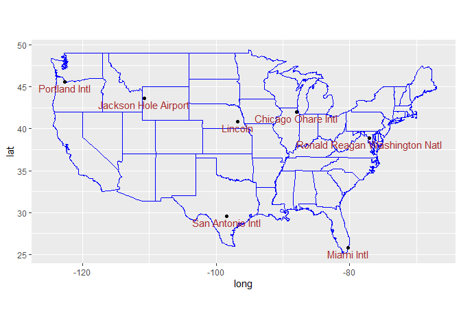

tidytext In_Class Assignment
================
Naga Vemprala
2023-03-23

## The questions in this markdown must be answered using the tidyr and dplyr packages’ functions.

#### The tidyverse functionality is greatly enhanced using the pipes (%\>% from magrittr)

#### Load the required packages before starting the assignment.

#### Questions 1 through 11 are related to tidyr (with one exception of using a base function - “replace”)

#### Questions 12 through 11 are related to tidyr (with one exception of using a base function - “replace”)

``` r
# Take a look at the religious income dataset, relig_income and answer if the dataset is a tidy dataset. 
# If not, why is it not a tidy dataset?
# Tidy the dataset using pivot_longer transformation. 
#you have to load the tidyverse package: all the functions follow snake naming convention
library(tidyverse)
```

    ## -- Attaching packages --------------------------------------- tidyverse 1.3.1 --

    ## v ggplot2 3.3.5     v purrr   0.3.4
    ## v tibble  3.1.6     v dplyr   1.0.8
    ## v tidyr   1.2.0     v stringr 1.4.0
    ## v readr   2.1.2     v forcats 0.5.1

    ## -- Conflicts ------------------------------------------ tidyverse_conflicts() --
    ## x dplyr::filter() masks stats::filter()
    ## x dplyr::lag()    masks stats::lag()

``` r
relig_income %>%
  pivot_longer(cols= -religion, names_to="income_range",values_to="income")
```

    ## # A tibble: 180 x 3
    ##    religion income_range       income
    ##    <chr>    <chr>               <dbl>
    ##  1 Agnostic <$10k                  27
    ##  2 Agnostic $10-20k                34
    ##  3 Agnostic $20-30k                60
    ##  4 Agnostic $30-40k                81
    ##  5 Agnostic $40-50k                76
    ##  6 Agnostic $50-75k               137
    ##  7 Agnostic $75-100k              122
    ##  8 Agnostic $100-150k             109
    ##  9 Agnostic >150k                  84
    ## 10 Agnostic Don't know/refused     96
    ## # ... with 170 more rows

``` r
library(tidyverse)
student_scores <- tribble(
  ~name, ~bus101, ~bus201, ~eco101, ~fin101, 
  "Billy", 90, 96, 70, 76, 
  "Suzy", 82, 76, 78, 86,
  "Lionel", 68, 56, 79, 82, 
  "Jenny", 72, 96, 71, 90,
)

# Merge the Business courses into a single column with the name "Business Courses" and the corresponding values from their respective column names. While saving the values, only use numeric course numbers 101 and 201. 
# Use names_prefix to supress character values from the column names 

student_scores %>%
  pivot_longer(cols=c("bus101","bus201"),names_to="Business_Courses",values_to="Score",names_prefix = "bus")
```

    ## # A tibble: 8 x 5
    ##   name   eco101 fin101 Business_Courses Score
    ##   <chr>   <dbl>  <dbl> <chr>            <dbl>
    ## 1 Billy      70     76 101                 90
    ## 2 Billy      70     76 201                 96
    ## 3 Suzy       78     86 101                 82
    ## 4 Suzy       78     86 201                 76
    ## 5 Lionel     79     82 101                 68
    ## 6 Lionel     79     82 201                 56
    ## 7 Jenny      71     90 101                 72
    ## 8 Jenny      71     90 201                 96

``` r
# Use the names pattern function to split required values. The value "bus101" should be split such that "bus" appears in the "major" column and "101" appears in the "course id" column.
# Use names_pattern to specify how each column should be split into the specified number of columns.
# Use names_to to provide the names of the new columns. 
student_scores %>%
  pivot_longer(cols= -name,names_to=c("Major","Courses"),values_to="Score",names_pattern="([a-z]{3})(0-9){3}")
```

    ## # A tibble: 16 x 4
    ##    name   Major Courses Score
    ##    <chr>  <chr> <chr>   <dbl>
    ##  1 Billy  <NA>  <NA>       90
    ##  2 Billy  <NA>  <NA>       96
    ##  3 Billy  <NA>  <NA>       70
    ##  4 Billy  <NA>  <NA>       76
    ##  5 Suzy   <NA>  <NA>       82
    ##  6 Suzy   <NA>  <NA>       76
    ##  7 Suzy   <NA>  <NA>       78
    ##  8 Suzy   <NA>  <NA>       86
    ##  9 Lionel <NA>  <NA>       68
    ## 10 Lionel <NA>  <NA>       56
    ## 11 Lionel <NA>  <NA>       79
    ## 12 Lionel <NA>  <NA>       82
    ## 13 Jenny  <NA>  <NA>       72
    ## 14 Jenny  <NA>  <NA>       96
    ## 15 Jenny  <NA>  <NA>       71
    ## 16 Jenny  <NA>  <NA>       90

``` r
# Take a look at each of these tables and anwer which table is tidy and which tables are not tidy. 
# table1 -tidy
# table2- untidy (we have to create separate columns for cases and population rows)
# table3- it has a composite variable
# table4a- cases- untidy- both the columns are  year so should not be separate
# table4b- population - untidy- both the columns are  year so should not be separate

#'table1, table2, table3, table4a, table4b, and table5 all display the number of  TB cases documented by the World Health Organization in Afghanistan, Brazil, and China between 1999 and 2000. The data contains values associated with four variables (country, year, cases, and population), but each table organizes the values in a different layout. 
#'The data is a subset of the data contained in the World Health Organization Global Tuberculosis Report
```

``` r
# Using table2, split the "type" column into two columns, with cases and population as column names. Use pivot_wider() function  

table2 %>%
  pivot_wider(names_from=type,values_from=count)
```

    ## # A tibble: 6 x 4
    ##   country      year  cases population
    ##   <chr>       <int>  <int>      <int>
    ## 1 Afghanistan  1999    745   19987071
    ## 2 Afghanistan  2000   2666   20595360
    ## 3 Brazil       1999  37737  172006362
    ## 4 Brazil       2000  80488  174504898
    ## 5 China        1999 212258 1272915272
    ## 6 China        2000 213766 1280428583

``` r
# Using table3, separate the rate column into two columns, cases and population. Use separate() function 

table3 %>%
  separate(col=rate,into=c("cases","population"),sep="/")
```

    ## # A tibble: 6 x 4
    ##   country      year cases  population
    ##   <chr>       <int> <chr>  <chr>     
    ## 1 Afghanistan  1999 745    19987071  
    ## 2 Afghanistan  2000 2666   20595360  
    ## 3 Brazil       1999 37737  172006362 
    ## 4 Brazil       2000 80488  174504898 
    ## 5 China        1999 212258 1272915272
    ## 6 China        2000 213766 1280428583

``` r
student_details <- tribble(
  ~name, ~day, ~month, ~year, ~"pass/fail", 
  "Billy", 15, 04, 96, "Pass", 
  "Suzy", 21, 10, 98, "Fail",
  "Lionel", 27, 09, 97, "Pass", 
  "Jenny", 01, 04, 99, "Pass"
)

student_details %>%
  unite(col="DOB",
          c("day","month","year"), sep="/")
```

    ## # A tibble: 4 x 3
    ##   name   DOB      `pass/fail`
    ##   <chr>  <chr>    <chr>      
    ## 1 Billy  15/4/96  Pass       
    ## 2 Suzy   21/10/98 Fail       
    ## 3 Lionel 27/9/97  Pass       
    ## 4 Jenny  1/4/99   Pass

``` r
# Use the complete() function of tidyr to insert rows with all possible combinations of name and course columns. 
student_scores <- tribble( 
  ~name, ~course, ~score, 
  "Billy", "bus101", 90,
  "Billy", "fin101", 76,
  "Suzy", "bus101", 82,
  "Suzy", "bus201", 76,
  "Suzy", "eco101", 78,
  "Suzy", "fin101", 86,
  "Lionel", "bus101", 68,
  "Lionel", "bus201", 56,
  "Lionel", "eco101", 79,
  "Lionel", "fin101", NA )

student_scores %>%
  complete(name,course)
```

    ## # A tibble: 12 x 3
    ##    name   course score
    ##    <chr>  <chr>  <dbl>
    ##  1 Billy  bus101    90
    ##  2 Billy  bus201    NA
    ##  3 Billy  eco101    NA
    ##  4 Billy  fin101    76
    ##  5 Lionel bus101    68
    ##  6 Lionel bus201    56
    ##  7 Lionel eco101    79
    ##  8 Lionel fin101    NA
    ##  9 Suzy   bus101    82
    ## 10 Suzy   bus201    76
    ## 11 Suzy   eco101    78
    ## 12 Suzy   fin101    86

``` r
# Find the indexes or row numbers of sleep dataset that has negative numbers in extra column 
# Make sure that the indexes are of integer type (Numeric)

# Use replace function to the negative numbers with 0

View(sleep)
replace(sleep$extra,as.integer(row.names(sleep[sleep$extra<0,])),0)
```

    ##  [1] 0.7 0.0 0.0 0.0 0.0 3.4 3.7 0.8 0.0 2.0 1.9 0.8 1.1 0.1 0.0 4.4 5.5 1.6 4.6
    ## [20] 3.4

``` r
# tibble will not accept a character data in a double coulmn. Therefore, replacing NA by 0.0 
student_scores <- tribble(
  ~name, ~course, ~score,

  "Billy",  "bus101", 90,
  "Billy",  "bus201", NA,
  "Billy", "eco101", NA,
  "Billy", "fin101", 76,
  "Lionel", "bus101", 68,
  "Lionel", "bus201", 56,
  "Lionel", "eco101", 79,
  "Lionel", "fin101", NA,
  "Suzy", "bus101", 82,
  "Suzy", "bus201", 76,
  "Suzy", "eco101", 78,
  "Suzy", "fin101", 86
)
student_scores %>%
  replace_na(list(score=0.0))
```

    ## # A tibble: 12 x 3
    ##    name   course score
    ##    <chr>  <chr>  <dbl>
    ##  1 Billy  bus101    90
    ##  2 Billy  bus201     0
    ##  3 Billy  eco101     0
    ##  4 Billy  fin101    76
    ##  5 Lionel bus101    68
    ##  6 Lionel bus201    56
    ##  7 Lionel eco101    79
    ##  8 Lionel fin101     0
    ##  9 Suzy   bus101    82
    ## 10 Suzy   bus201    76
    ## 11 Suzy   eco101    78
    ## 12 Suzy   fin101    86

#### dplyr functions

``` r
superheroes <- tibble::tribble(
       ~name, ~alignment,  ~gender,          ~publisher,
   "Magneto",      "bad",   "male",            "Marvel",
     "Storm",     "good", "female",            "Marvel",
  "Mystique",      "bad", "female",            "Marvel",
    "Batman",     "good",   "male",                "DC",
     "Joker",      "bad",   "male",                "DC",
  "Catwoman",      "bad", "female",                "DC",
   "Hellboy",     "good",   "male", "Dark Horse Comics"
  )

publishers <- tibble::tribble(
  ~publisher, ~yr_founded,
        "DC",       1934L,
    "Marvel",       1939L,
     "Image",       1992L
  )

# Use inner_join to join superheroes and publishers on publisher column.
superheroes %>%
  inner_join(publishers)
```

    ## Joining, by = "publisher"

    ## # A tibble: 6 x 5
    ##   name     alignment gender publisher yr_founded
    ##   <chr>    <chr>     <chr>  <chr>          <int>
    ## 1 Magneto  bad       male   Marvel          1939
    ## 2 Storm    good      female Marvel          1939
    ## 3 Mystique bad       female Marvel          1939
    ## 4 Batman   good      male   DC              1934
    ## 5 Joker    bad       male   DC              1934
    ## 6 Catwoman bad       female DC              1934

``` r
# Use semi_join to join superheroes and publishers on publisher column.
superheroes %>%
  semi_join(publishers)
```

    ## Joining, by = "publisher"

    ## # A tibble: 6 x 4
    ##   name     alignment gender publisher
    ##   <chr>    <chr>     <chr>  <chr>    
    ## 1 Magneto  bad       male   Marvel   
    ## 2 Storm    good      female Marvel   
    ## 3 Mystique bad       female Marvel   
    ## 4 Batman   good      male   DC       
    ## 5 Joker    bad       male   DC       
    ## 6 Catwoman bad       female DC

``` r
# What is the difference between these two types of joins? 
#ANSWER:
#inner_join() is taking the yr_founded also in the answer but the semi_join() is ignoring the yr_founded in the final result
# Just like a left join in SQL 
```

``` r
# Display the diamond count by cut and color. Include only the rows with a diamond count greater than 300.

diamonds%>%
  group_by(cut,color) %>%
  summarize(count_records=n())%>%
  filter(count_records>300)
```

    ## `summarise()` has grouped output by 'cut'. You can override using the `.groups`
    ## argument.

    ## # A tibble: 31 x 3
    ## # Groups:   cut [5]
    ##    cut   color count_records
    ##    <ord> <ord>         <int>
    ##  1 Fair  F               312
    ##  2 Fair  G               314
    ##  3 Fair  H               303
    ##  4 Good  D               662
    ##  5 Good  E               933
    ##  6 Good  F               909
    ##  7 Good  G               871
    ##  8 Good  H               702
    ##  9 Good  I               522
    ## 10 Good  J               307
    ## # ... with 21 more rows

``` r
library(nycflights13) # Requires package installation
 
airports %>% filter(faa %in% c("PDX", "DCA", "LNK", "JAC", "SAT", "ORD", "MIA") ) %>% 
  ggplot() +
     borders("state", colour = "blue") +
     geom_point(aes(lon, lat)) + 
     geom_text(aes(lon, lat, label = name), color = "brown", vjust = 1.25)+
     coord_quickmap()
```

<!-- -->

``` r
# Using slice function fetch the rows from 10th row to 15th row

# Uncomment the code below to complete the response 
# diamonds %>% 
#  slice()

diamonds %>% 
  slice(10:15)
```

    ## # A tibble: 6 x 10
    ##   carat cut       color clarity depth table price     x     y     z
    ##   <dbl> <ord>     <ord> <ord>   <dbl> <dbl> <int> <dbl> <dbl> <dbl>
    ## 1  0.23 Very Good H     VS1      59.4    61   338  4     4.05  2.39
    ## 2  0.3  Good      J     SI1      64      55   339  4.25  4.28  2.73
    ## 3  0.23 Ideal     J     VS1      62.8    56   340  3.93  3.9   2.46
    ## 4  0.22 Premium   F     SI1      60.4    61   342  3.88  3.84  2.33
    ## 5  0.31 Ideal     J     SI2      62.2    54   344  4.35  4.37  2.71
    ## 6  0.2  Premium   E     SI2      60.2    62   345  3.79  3.75  2.27

``` r
# Using mutate function create a normalized price value. Create a new column price_normal
# price_normal is (price - mean(price))/ standard_deviation(price)
# No need to save the output dataset to a new diamonds dataset 
# Verify that the new column was created correctly by including the following line of code at the end of the pipe operation
# filter(price == 3932 | price == 3935)

summary(diamonds$price)
```

    ##    Min. 1st Qu.  Median    Mean 3rd Qu.    Max. 
    ##     326     950    2401    3933    5324   18823

``` r
sd(diamonds$price)
```

    ## [1] 3989.44

``` r
diamonds %>%
  mutate(normal_price=(price-mean(price))/sd(price)) %>% 
  filter(price == 3932 | price == 3935)
```

    ## # A tibble: 4 x 11
    ##   carat cut     color clarity depth table price     x     y     z normal_price
    ##   <dbl> <ord>   <ord> <ord>   <dbl> <dbl> <int> <dbl> <dbl> <dbl>        <dbl>
    ## 1  1.01 Good    D     SI2      64      59  3932  6.28  6.34  4.04    -0.000200
    ## 2  0.92 Premium I     VVS1     62.4    59  3932  6.17  6.14  3.84    -0.000200
    ## 3  1.06 Ideal   J     SI2      61.3    57  3932  6.55  6.6   4.03    -0.000200
    ## 4  0.81 Ideal   E     SI1      61.9    56  3935  5.97  6.02  3.71     0.000552

#### The scoped variants of mutate() and transmute() make it easy to apply the same transformation to multiple variables. There are three variants:

-   \_all affects every variable

-   \_at affects variables selected with a character vector or vars()

-   \_if affects variables selected with a predicate function:

``` r
# using mutate_at add $10 to the price
# This is the syntax of mutate_at
# mutate_at(.tbl, .vars, .funs, ..., .cols = NULL) 

increment_10 <- function(x) { x + 10}
diamonds %>% 
  mutate_at(.vars = c("price"), 
            .funs = increment_10)
```

    ## # A tibble: 53,940 x 10
    ##    carat cut       color clarity depth table price     x     y     z
    ##    <dbl> <ord>     <ord> <ord>   <dbl> <dbl> <dbl> <dbl> <dbl> <dbl>
    ##  1  0.23 Ideal     E     SI2      61.5    55   336  3.95  3.98  2.43
    ##  2  0.21 Premium   E     SI1      59.8    61   336  3.89  3.84  2.31
    ##  3  0.23 Good      E     VS1      56.9    65   337  4.05  4.07  2.31
    ##  4  0.29 Premium   I     VS2      62.4    58   344  4.2   4.23  2.63
    ##  5  0.31 Good      J     SI2      63.3    58   345  4.34  4.35  2.75
    ##  6  0.24 Very Good J     VVS2     62.8    57   346  3.94  3.96  2.48
    ##  7  0.24 Very Good I     VVS1     62.3    57   346  3.95  3.98  2.47
    ##  8  0.26 Very Good H     SI1      61.9    55   347  4.07  4.11  2.53
    ##  9  0.22 Fair      E     VS2      65.1    61   347  3.87  3.78  2.49
    ## 10  0.23 Very Good H     VS1      59.4    61   348  4     4.05  2.39
    ## # ... with 53,930 more rows

``` r
diamonds %>% 
  mutate_at(.vars = c("price"), 
            .funs = function(x) x + 10)
```

    ## # A tibble: 53,940 x 10
    ##    carat cut       color clarity depth table price     x     y     z
    ##    <dbl> <ord>     <ord> <ord>   <dbl> <dbl> <dbl> <dbl> <dbl> <dbl>
    ##  1  0.23 Ideal     E     SI2      61.5    55   336  3.95  3.98  2.43
    ##  2  0.21 Premium   E     SI1      59.8    61   336  3.89  3.84  2.31
    ##  3  0.23 Good      E     VS1      56.9    65   337  4.05  4.07  2.31
    ##  4  0.29 Premium   I     VS2      62.4    58   344  4.2   4.23  2.63
    ##  5  0.31 Good      J     SI2      63.3    58   345  4.34  4.35  2.75
    ##  6  0.24 Very Good J     VVS2     62.8    57   346  3.94  3.96  2.48
    ##  7  0.24 Very Good I     VVS1     62.3    57   346  3.95  3.98  2.47
    ##  8  0.26 Very Good H     SI1      61.9    55   347  4.07  4.11  2.53
    ##  9  0.22 Fair      E     VS2      65.1    61   347  3.87  3.78  2.49
    ## 10  0.23 Very Good H     VS1      59.4    61   348  4     4.05  2.39
    ## # ... with 53,930 more rows

``` r
diamonds %>% 
  mutate_at(.vars = c("price", "depth"), 
            .funs = function(x) x + 10)
```

    ## # A tibble: 53,940 x 10
    ##    carat cut       color clarity depth table price     x     y     z
    ##    <dbl> <ord>     <ord> <ord>   <dbl> <dbl> <dbl> <dbl> <dbl> <dbl>
    ##  1  0.23 Ideal     E     SI2      71.5    55   336  3.95  3.98  2.43
    ##  2  0.21 Premium   E     SI1      69.8    61   336  3.89  3.84  2.31
    ##  3  0.23 Good      E     VS1      66.9    65   337  4.05  4.07  2.31
    ##  4  0.29 Premium   I     VS2      72.4    58   344  4.2   4.23  2.63
    ##  5  0.31 Good      J     SI2      73.3    58   345  4.34  4.35  2.75
    ##  6  0.24 Very Good J     VVS2     72.8    57   346  3.94  3.96  2.48
    ##  7  0.24 Very Good I     VVS1     72.3    57   346  3.95  3.98  2.47
    ##  8  0.26 Very Good H     SI1      71.9    55   347  4.07  4.11  2.53
    ##  9  0.22 Fair      E     VS2      75.1    61   347  3.87  3.78  2.49
    ## 10  0.23 Very Good H     VS1      69.4    61   348  4     4.05  2.39
    ## # ... with 53,930 more rows

``` r
diamonds %>% 
  mutate_at(.vars = c("price"), 
            .funs = list(new_price = function(x) x + 10))
```

    ## # A tibble: 53,940 x 11
    ##    carat cut       color clarity depth table price     x     y     z new_price
    ##    <dbl> <ord>     <ord> <ord>   <dbl> <dbl> <int> <dbl> <dbl> <dbl>     <dbl>
    ##  1  0.23 Ideal     E     SI2      61.5    55   326  3.95  3.98  2.43       336
    ##  2  0.21 Premium   E     SI1      59.8    61   326  3.89  3.84  2.31       336
    ##  3  0.23 Good      E     VS1      56.9    65   327  4.05  4.07  2.31       337
    ##  4  0.29 Premium   I     VS2      62.4    58   334  4.2   4.23  2.63       344
    ##  5  0.31 Good      J     SI2      63.3    58   335  4.34  4.35  2.75       345
    ##  6  0.24 Very Good J     VVS2     62.8    57   336  3.94  3.96  2.48       346
    ##  7  0.24 Very Good I     VVS1     62.3    57   336  3.95  3.98  2.47       346
    ##  8  0.26 Very Good H     SI1      61.9    55   337  4.07  4.11  2.53       347
    ##  9  0.22 Fair      E     VS2      65.1    61   337  3.87  3.78  2.49       347
    ## 10  0.23 Very Good H     VS1      59.4    61   338  4     4.05  2.39       348
    ## # ... with 53,930 more rows

``` r
# using mutate across, add $10 to the price. mutate across is the preferred method. 
# use mutate(across( .. rest all should be the same
# mutate(across(.cols = everything(), .fns = NULL, ..., .names = NULL) 

diamonds %>% 
  mutate(across(.cols = "price", 
                .fns = function(x) x + 10))
```

    ## # A tibble: 53,940 x 10
    ##    carat cut       color clarity depth table price     x     y     z
    ##    <dbl> <ord>     <ord> <ord>   <dbl> <dbl> <dbl> <dbl> <dbl> <dbl>
    ##  1  0.23 Ideal     E     SI2      61.5    55   336  3.95  3.98  2.43
    ##  2  0.21 Premium   E     SI1      59.8    61   336  3.89  3.84  2.31
    ##  3  0.23 Good      E     VS1      56.9    65   337  4.05  4.07  2.31
    ##  4  0.29 Premium   I     VS2      62.4    58   344  4.2   4.23  2.63
    ##  5  0.31 Good      J     SI2      63.3    58   345  4.34  4.35  2.75
    ##  6  0.24 Very Good J     VVS2     62.8    57   346  3.94  3.96  2.48
    ##  7  0.24 Very Good I     VVS1     62.3    57   346  3.95  3.98  2.47
    ##  8  0.26 Very Good H     SI1      61.9    55   347  4.07  4.11  2.53
    ##  9  0.22 Fair      E     VS2      65.1    61   347  3.87  3.78  2.49
    ## 10  0.23 Very Good H     VS1      59.4    61   348  4     4.05  2.39
    ## # ... with 53,930 more rows

``` r
# using mutate_if increase price by $10
# mutate_if(.tbl, .predicate, .funs, ...)
diamonds %>% 
  mutate_if(colnames(.) == "price", .funs = function(x) x + 10)
```

    ## # A tibble: 53,940 x 10
    ##    carat cut       color clarity depth table price     x     y     z
    ##    <dbl> <ord>     <ord> <ord>   <dbl> <dbl> <dbl> <dbl> <dbl> <dbl>
    ##  1  0.23 Ideal     E     SI2      61.5    55   336  3.95  3.98  2.43
    ##  2  0.21 Premium   E     SI1      59.8    61   336  3.89  3.84  2.31
    ##  3  0.23 Good      E     VS1      56.9    65   337  4.05  4.07  2.31
    ##  4  0.29 Premium   I     VS2      62.4    58   344  4.2   4.23  2.63
    ##  5  0.31 Good      J     SI2      63.3    58   345  4.34  4.35  2.75
    ##  6  0.24 Very Good J     VVS2     62.8    57   346  3.94  3.96  2.48
    ##  7  0.24 Very Good I     VVS1     62.3    57   346  3.95  3.98  2.47
    ##  8  0.26 Very Good H     SI1      61.9    55   347  4.07  4.11  2.53
    ##  9  0.22 Fair      E     VS2      65.1    61   347  3.87  3.78  2.49
    ## 10  0.23 Very Good H     VS1      59.4    61   348  4     4.05  2.39
    ## # ... with 53,930 more rows

``` r
# using mutate function add a new column to the diamonds dataset called discounted_price to capture discounted price depending on the cut of the diamond.  
# if "Fair" - price*.90, if "Good" - price*.85, if "Very Good" - price*.80, if "Premium" - price*.75, if "Ideal" - price*.75

diamonds %>% 
  mutate(discounted_price = case_when(cut == "Fair" ~ 0.9*price, 
                                      cut == "Good" ~ 0.85*price, 
                                      cut == "Very Good" ~ 0.8*price, 
                                      cut == "Premium" ~ 0.75*price, 
                                      TRUE ~ 0.75*price)
         )
```

    ## # A tibble: 53,940 x 11
    ##    carat cut       color clarity depth table price     x     y     z
    ##    <dbl> <ord>     <ord> <ord>   <dbl> <dbl> <int> <dbl> <dbl> <dbl>
    ##  1  0.23 Ideal     E     SI2      61.5    55   326  3.95  3.98  2.43
    ##  2  0.21 Premium   E     SI1      59.8    61   326  3.89  3.84  2.31
    ##  3  0.23 Good      E     VS1      56.9    65   327  4.05  4.07  2.31
    ##  4  0.29 Premium   I     VS2      62.4    58   334  4.2   4.23  2.63
    ##  5  0.31 Good      J     SI2      63.3    58   335  4.34  4.35  2.75
    ##  6  0.24 Very Good J     VVS2     62.8    57   336  3.94  3.96  2.48
    ##  7  0.24 Very Good I     VVS1     62.3    57   336  3.95  3.98  2.47
    ##  8  0.26 Very Good H     SI1      61.9    55   337  4.07  4.11  2.53
    ##  9  0.22 Fair      E     VS2      65.1    61   337  3.87  3.78  2.49
    ## 10  0.23 Very Good H     VS1      59.4    61   338  4     4.05  2.39
    ## # ... with 53,930 more rows, and 1 more variable: discounted_price <dbl>

``` r
# sort the diamonds dataset by cut column and select, price, cut and depth columns 
diamonds %>% 
  arrange(desc(cut)) %>% 
  select(price, cut, depth)
```

    ## # A tibble: 53,940 x 3
    ##    price cut   depth
    ##    <int> <ord> <dbl>
    ##  1   326 Ideal  61.5
    ##  2   340 Ideal  62.8
    ##  3   344 Ideal  62.2
    ##  4   348 Ideal  62  
    ##  5   403 Ideal  61.8
    ##  6   403 Ideal  61.2
    ##  7   403 Ideal  61.1
    ##  8   404 Ideal  61.9
    ##  9   404 Ideal  60.9
    ## 10   405 Ideal  61  
    ## # ... with 53,930 more rows

``` r
# Using the diamonds dataset and summarize function, calculate the mean_price, mean_depth, and variance_x (using x variable) 
diamonds %>%
 group_by(cut) %>%
  summarize(mean_price=mean(price),
            mean_Depth=mean(depth),
            variance_x=sd(x)^2)
```

    ## # A tibble: 5 x 4
    ##   cut       mean_price mean_Depth variance_x
    ##   <ord>          <dbl>      <dbl>      <dbl>
    ## 1 Fair           4359.       64.0      0.930
    ## 2 Good           3929.       62.4      1.12 
    ## 3 Very Good      3982.       61.8      1.21 
    ## 4 Premium        4584.       61.3      1.41 
    ## 5 Ideal          3458.       61.7      1.13

``` r
# Complete the code below to generate a dataset containing the datetime and price of a fictitious cryptocoin with a consistent hourly increase of 0.001 in value.)
library(lubridate)
```

    ## 
    ## Attaching package: 'lubridate'

    ## The following objects are masked from 'package:base':
    ## 
    ##     date, intersect, setdiff, union

``` r
total_hours <- ymd_hms("2023-03-01 00:00:00") + 0:200*24 # Some 200 random days
# Uncomment the line of code below to complete a mutate & a cumsum function and create a variable that stores the cumulative price increase. Utilize a rnorm with a mean of 0.001 and a standard deviation of 0.01

crypto_price <- as.tibble(total_hours) %>% 
  mutate(price = 0.07 + cumsum(rnorm(n(), mean = 0.001, sd = 0.01)))
```

    ## Warning: `as.tibble()` was deprecated in tibble 2.0.0.
    ## Please use `as_tibble()` instead.
    ## The signature and semantics have changed, see `?as_tibble`.
    ## This warning is displayed once every 8 hours.
    ## Call `lifecycle::last_lifecycle_warnings()` to see where this warning was generated.

``` r
# View(crypto_price)
plot(x = crypto_price$value, y = crypto_price$price)
```

<!-- -->

``` r
# create a union of the diamonds1 and diamonds2 datasets
# Look at the cheatsheet for understanding these functions. Also, please pay attention to the intersect function you are using. 
diamonds1 <- diamonds[diamonds$depth < 50,]
diamonds2 <- diamonds[diamonds$depth < 55,]
diamonds1 %>%
  dplyr::union(diamonds2)
```

    ## # A tibble: 22 x 10
    ##    carat cut   color clarity depth table price     x     y     z
    ##    <dbl> <ord> <ord> <ord>   <dbl> <dbl> <int> <dbl> <dbl> <dbl>
    ##  1  1    Fair  G     SI1      43      59  3634  6.32  6.27  3.97
    ##  2  1    Fair  G     VS2      44      53  4032  6.31  6.24  4.12
    ##  3  1.09 Ideal J     VS2      43      54  4778  6.53  6.55  4.12
    ##  4  0.96 Fair  E     SI2      53.1    63  2815  6.73  6.65  3.55
    ##  5  0.98 Fair  E     SI2      53.3    67  2855  6.82  6.74  3.61
    ##  6  1.02 Fair  I     SI1      53      63  2856  6.84  6.77  3.66
    ##  7  1.08 Fair  E     SI1      53.8    63  4790  6.99  6.81  3.71
    ##  8  1.26 Fair  G     SI2      53.2    61  4966  7.44  7.36  3.94
    ##  9  1.43 Fair  I     VS1      50.8    60  6727  7.73  7.25  3.93
    ## 10  0.31 Fair  E     VS2      54.2    63   814  4.61  4.51  2.47
    ## # ... with 12 more rows

``` r
# create a intersection of the diamonds1 and diamonds2 datasets
diamonds1 %>% 
  dplyr::intersect(diamonds2)
```

    ## # A tibble: 3 x 10
    ##   carat cut   color clarity depth table price     x     y     z
    ##   <dbl> <ord> <ord> <ord>   <dbl> <dbl> <int> <dbl> <dbl> <dbl>
    ## 1  1    Fair  G     SI1        43    59  3634  6.32  6.27  3.97
    ## 2  1    Fair  G     VS2        44    53  4032  6.31  6.24  4.12
    ## 3  1.09 Ideal J     VS2        43    54  4778  6.53  6.55  4.12

``` r
# use setdiff function of dplyr to find the rows that differ diamonds1 and diamonds2 datasets
diamonds2 %>% 
  dplyr::setdiff(diamonds1)
```

    ## # A tibble: 19 x 10
    ##    carat cut   color clarity depth table price     x     y     z
    ##    <dbl> <ord> <ord> <ord>   <dbl> <dbl> <int> <dbl> <dbl> <dbl>
    ##  1  0.96 Fair  E     SI2      53.1    63  2815  6.73  6.65  3.55
    ##  2  0.98 Fair  E     SI2      53.3    67  2855  6.82  6.74  3.61
    ##  3  1.02 Fair  I     SI1      53      63  2856  6.84  6.77  3.66
    ##  4  1.08 Fair  E     SI1      53.8    63  4790  6.99  6.81  3.71
    ##  5  1.26 Fair  G     SI2      53.2    61  4966  7.44  7.36  3.94
    ##  6  1.43 Fair  I     VS1      50.8    60  6727  7.73  7.25  3.93
    ##  7  0.31 Fair  E     VS2      54.2    63   814  4.61  4.51  2.47
    ##  8  0.3  Fair  E     VVS2     51      67   945  4.67  4.62  2.37
    ##  9  0.31 Fair  D     VVS2     54.2    65   997  4.61  4.58  2.49
    ## 10  0.35 Fair  F     VVS1     54.6    59  1011  4.85  4.79  2.63
    ## 11  0.35 Fair  D     VVS2     53.2    62  1011  4.87  4.8   2.57
    ## 12  0.34 Fair  E     VVS1     54      56  1012  4.8   4.76  2.58
    ## 13  0.25 Fair  F     SI2      54.4    64  1013  4.3   4.23  2.32
    ## 14  0.37 Fair  F     IF       52.3    61  1166  4.96  4.91  2.58
    ## 15  0.56 Fair  H     VS2      52.7    70  1293  5.71  5.57  2.97
    ## 16  0.53 Good  D     SI2      54.3    65  1352  5.46  5.51  2.98
    ## 17  0.7  Fair  D     SI1      52.2    65  1895  6.04  5.99  3.14
    ## 18  0.73 Fair  F     SI2      53.4    65  2164  6.19  6.15  3.3 
    ## 19  0.78 Fair  H     VS2      54.7    67  2691  6.25  6.15  3.4
