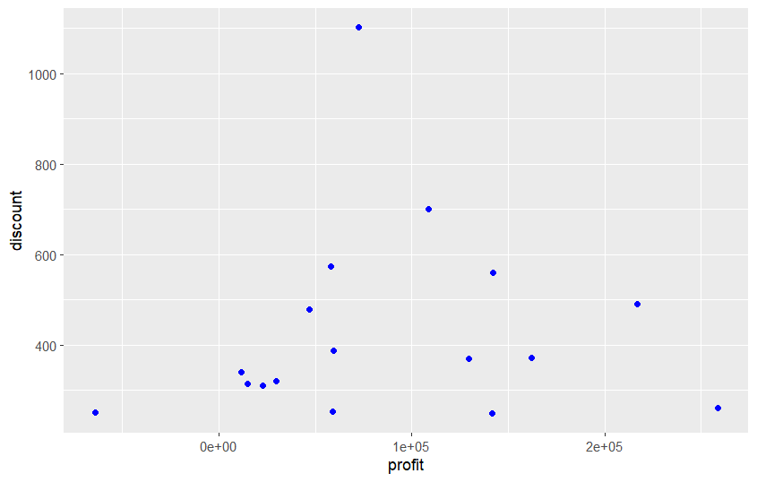
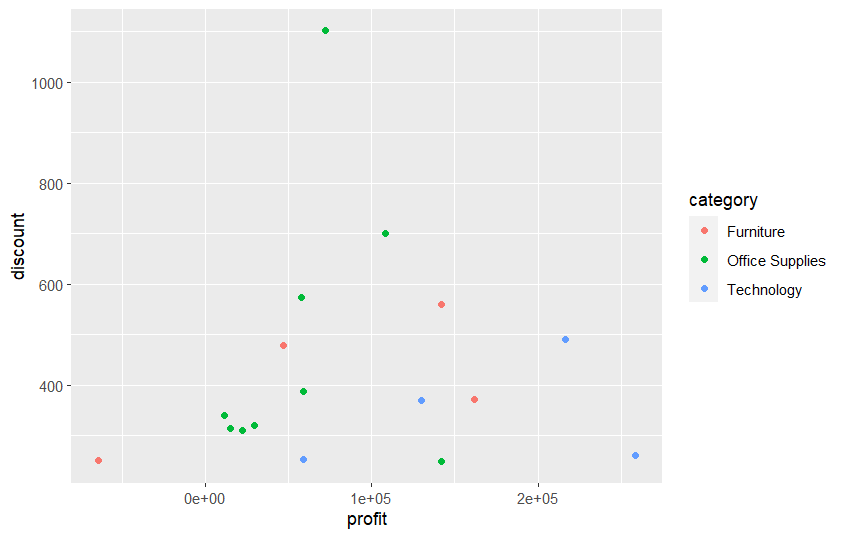
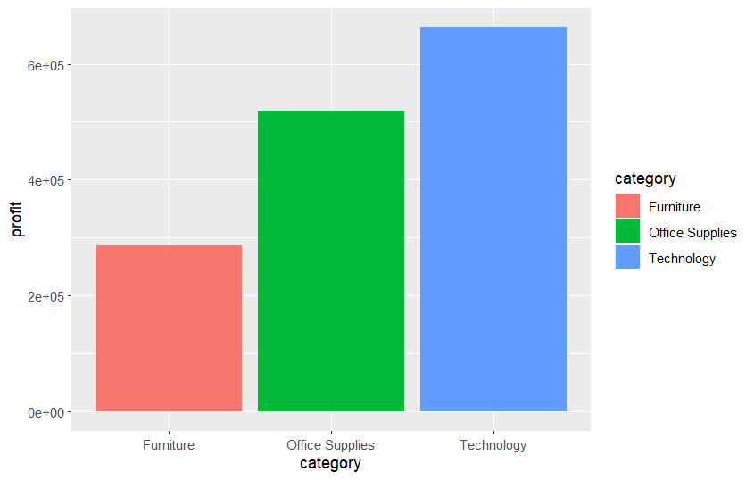
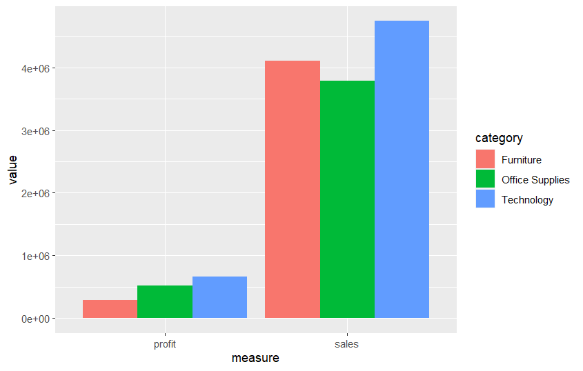
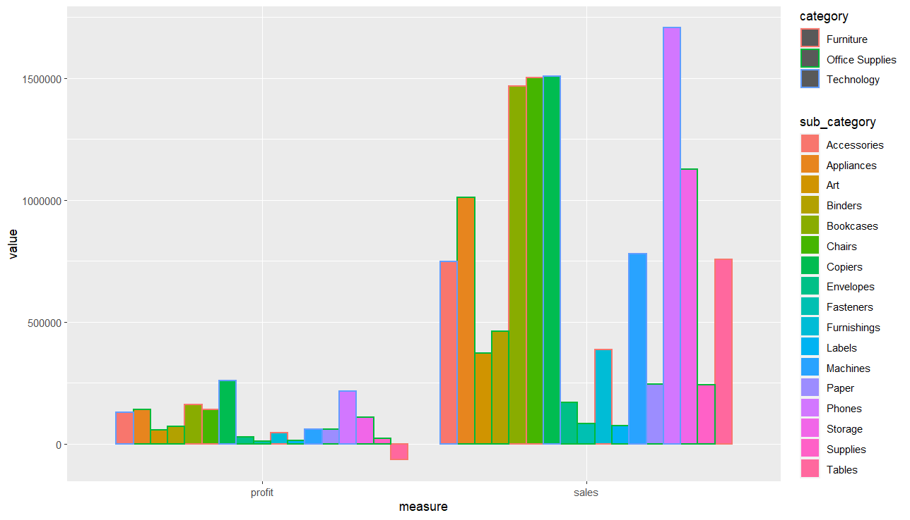
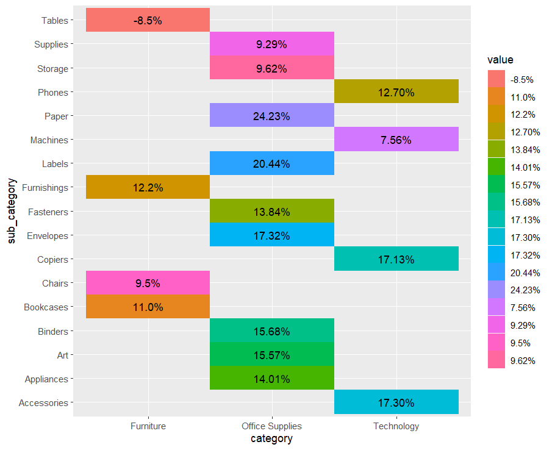

```{r setup, include=FALSE}
knitr::opts_chunk$set(echo = TRUE, fig.align = 'left')
```

## Project 02 - 
* Input file "Project02_SuperStoreOrders.csv"


```{r read_file, echo=FALSE}
ordersDF <- read.csv('Datasets/Project02_SuperStoreOrders.csv')
head(ordersDF)
```

## Use the code from in-class dplyr activity to generate the group statistics by category and generate the plots. 
### Create the sum total of sales, quantity, discount, profit, and shipping_cost by category and sub-category. You should get 17 rows. Make sure that there are no NA values. Data processing is key.  

```{r group_profits, echo=FALSE}
ordersDF <- read.csv('Datasets/Project02_SuperStoreOrders.csv')
ordersDF$sales <- as.numeric(gsub(",", "", ordersDF$sales))
head(ordersDF)
```

```{r hidden-code1, echo=FALSE}
library(dplyr)
orders_by_category <- ordersDF %>% 
  select(category, sub_category, sales, quantity, discount, profit, shipping_cost) %>%
  group_by(category, sub_category) %>% 
  summarise(sales = sum(sales),
            quantity = sum(quantity),
            discount = sum(discount),
            profit = sum(profit),
            shipping_cost = sum(shipping_cost)
            )
```

## Create a plot similar to the one given below: 


```{r question-1}
# Run the code chunk to see the graph that you need to produce 
# Make sure you set the knitr::opts_chunk$set(echo = TRUE, fig.align = 'left') at the beginning of the document so that the images are visibly displayed. 

```


```{r Q1, echo=FALSE}
library(ggplot2)
# Include the code to generate the graph provided in the above png file. 
```


```{r question-2}
# Run the code chunk to see the graph that you need to produce


```


```{r Q2, echo=FALSE}
# Include the code to generate the graph provided in the above png file. 
```

### Create the sum total of sales, quantity, discount, profit, and shipping_cost by category only to plot the total sales and profit by category. You should get only 3 rows as there are only 3 categories. But do not override the previous dataframe with the new dataframe. The dataframe created earlier with 17 rows will be used in the next question.  

```{r question-3}
# Run the code chunk to see the graph that you need to produce


```


```{r Q3, echo=FALSE}
# Include the code to generate the graph provided in the above png file. 
```

## Data transformation is required for creating the bar chart stacked horizontally. Hint: use pivot_longer. Also, do not use the dataframe with 17 rows. Use the dataframe created using a group by "category" 

```{r question-4}
# Run the code chunk to see the graph that you need to produce


```


```{r Q4, echo=FALSE}
# Include the code to generate the graph provided in the above png file. 
```


### Create the graph using the dataframe created grouping the summary by category and sub-category (17 rows). Hint: Again, you need to use the pivot_longer to transform records  

```{r question-5}
# Run the code chunk to see the graph that you need to produce


```


```{r Q5, echo=FALSE}
# Include the code to generate the graph provided in the above png file. 
```


```{r question-6}
# Run the code chunk to see the graph that you need to produce


```


```{r Q6, echo=FALSE}
# Include the code to generate the graph provided in the above png file. 
```


