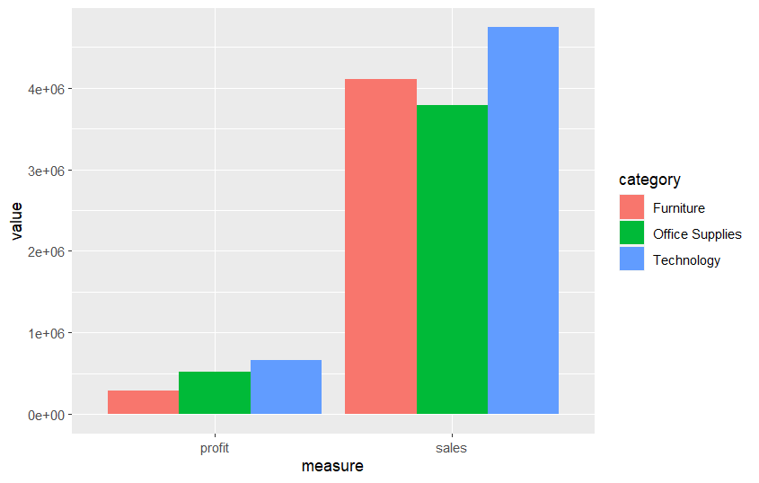

10_S23_Project02_ggplot2
================
Naga Vemprala
2022-12-27

## Project 02 -

-   Input file “Project02_SuperStoreOrders.csv”

<!-- -->

    ##       ï..order_id order_date ship_date      ship_mode   customer_name
    ## 1    AG-2011-2040   1/1/2011  6/1/2011 Standard Class Toby Braunhardt
    ## 2   IN-2011-47883   1/1/2011  8/1/2011 Standard Class     Joseph Holt
    ## 3    HU-2011-1220   1/1/2011  5/1/2011   Second Class   Annie Thurman
    ## 4 IT-2011-3647632   1/1/2011  5/1/2011   Second Class    Eugene Moren
    ## 5   IN-2011-47883   1/1/2011  8/1/2011 Standard Class     Joseph Holt
    ## 6   IN-2011-47883   1/1/2011  8/1/2011 Standard Class     Joseph Holt
    ##       segment           state   country market  region       product_id
    ## 1    Consumer     Constantine   Algeria Africa  Africa OFF-TEN-10000025
    ## 2    Consumer New South Wales Australia   APAC Oceania  OFF-SU-10000618
    ## 3    Consumer        Budapest   Hungary   EMEA    EMEA OFF-TEN-10001585
    ## 4 Home Office       Stockholm    Sweden     EU   North  OFF-PA-10001492
    ## 5    Consumer New South Wales Australia   APAC Oceania  FUR-FU-10003447
    ## 6    Consumer New South Wales Australia   APAC Oceania  OFF-PA-10001968
    ##          category sub_category                            product_name sales
    ## 1 Office Supplies      Storage                     Tenex Lockers, Blue   408
    ## 2 Office Supplies     Supplies                Acme Trimmer, High Speed   120
    ## 3 Office Supplies      Storage                 Tenex Box, Single Width    66
    ## 4 Office Supplies        Paper             Enermax Note Cards, Premium    45
    ## 5       Furniture  Furnishings              Eldon Light Bulb, Duo Pack   114
    ## 6 Office Supplies        Paper Eaton Computer Printout Paper, 8.5 x 11    55
    ##   quantity discount  profit shipping_cost order_priority year
    ## 1        2      0.0 106.140         35.46         Medium 2011
    ## 2        3      0.1  36.036          9.72         Medium 2011
    ## 3        4      0.0  29.640          8.17           High 2011
    ## 4        3      0.5 -26.055          4.82           High 2011
    ## 5        5      0.1  37.770          4.70         Medium 2011
    ## 6        2      0.1  15.342          1.80         Medium 2011

## Use the code from in-class dplyr activity to generate the group statistics by category and generate the plots.

### Create the sum total of sales, quantity, discount, profit, and shipping_cost by category and sub-category. You should get 17 rows. Make sure that there are no NA values. Data processing is key.

    ##       ï..order_id order_date ship_date      ship_mode   customer_name
    ## 1    AG-2011-2040   1/1/2011  6/1/2011 Standard Class Toby Braunhardt
    ## 2   IN-2011-47883   1/1/2011  8/1/2011 Standard Class     Joseph Holt
    ## 3    HU-2011-1220   1/1/2011  5/1/2011   Second Class   Annie Thurman
    ## 4 IT-2011-3647632   1/1/2011  5/1/2011   Second Class    Eugene Moren
    ## 5   IN-2011-47883   1/1/2011  8/1/2011 Standard Class     Joseph Holt
    ## 6   IN-2011-47883   1/1/2011  8/1/2011 Standard Class     Joseph Holt
    ##       segment           state   country market  region       product_id
    ## 1    Consumer     Constantine   Algeria Africa  Africa OFF-TEN-10000025
    ## 2    Consumer New South Wales Australia   APAC Oceania  OFF-SU-10000618
    ## 3    Consumer        Budapest   Hungary   EMEA    EMEA OFF-TEN-10001585
    ## 4 Home Office       Stockholm    Sweden     EU   North  OFF-PA-10001492
    ## 5    Consumer New South Wales Australia   APAC Oceania  FUR-FU-10003447
    ## 6    Consumer New South Wales Australia   APAC Oceania  OFF-PA-10001968
    ##          category sub_category                            product_name sales
    ## 1 Office Supplies      Storage                     Tenex Lockers, Blue   408
    ## 2 Office Supplies     Supplies                Acme Trimmer, High Speed   120
    ## 3 Office Supplies      Storage                 Tenex Box, Single Width    66
    ## 4 Office Supplies        Paper             Enermax Note Cards, Premium    45
    ## 5       Furniture  Furnishings              Eldon Light Bulb, Duo Pack   114
    ## 6 Office Supplies        Paper Eaton Computer Printout Paper, 8.5 x 11    55
    ##   quantity discount  profit shipping_cost order_priority year
    ## 1        2      0.0 106.140         35.46         Medium 2011
    ## 2        3      0.1  36.036          9.72         Medium 2011
    ## 3        4      0.0  29.640          8.17           High 2011
    ## 4        3      0.5 -26.055          4.82           High 2011
    ## 5        5      0.1  37.770          4.70         Medium 2011
    ## 6        2      0.1  15.342          1.80         Medium 2011

    ## 
    ## Attaching package: 'dplyr'

    ## The following objects are masked from 'package:stats':
    ## 
    ##     filter, lag

    ## The following objects are masked from 'package:base':
    ## 
    ##     intersect, setdiff, setequal, union

    ## `summarise()` has grouped output by 'category'. You can override using the
    ## `.groups` argument.

## Create a plot similar to the one given below:

``` r
# Run the code chunk to see the graph that you need to produce 
# Make sure you set the knitr::opts_chunk$set(echo = TRUE, fig.align = 'left') at the beginning of the document so that the images are visibly displayed. 
knitr::include_graphics("Images/project02_Q1.png")
```


``` r
# Run the code chunk to see the graph that you need to produce

knitr::include_graphics("Images/project02_Q2.png")
```


### Create the sum total of sales, quantity, discount, profit, and shipping_cost by category only to plot the total sales and profit by category. You should get only 3 rows as there are only 3 categories. But do not override the previous dataframe with the new dataframe. The dataframe created earlier with 17 rows will be used in the next question.

``` r
# Run the code chunk to see the graph that you need to produce

knitr::include_graphics("Images/project02_Q3.png")
```


## Data transformation is required for creating the bar chart stacked horizontally. Hint: use pivot_longer. Also, do not use the dataframe with 17 rows. Use the dataframe created using a group by “category”

``` r
# Run the code chunk to see the graph that you need to produce


```


### Create the graph using the dataframe created grouping the summary by category and sub-category (17 rows). Hint: Again, you need to use the pivot_longer to transform records

``` r
# Run the code chunk to see the graph that you need to produce

knitr::include_graphics("Images/project02_Q5.png")
```


``` r
# Run the code chunk to see the graph that you need to produce

knitr::include_graphics("Images/project02_Q6.png")
```


