GGPLOT2
================
Naga Vemprala
2023-02-05

## Grammar of Graphics (Layered Grammar of Graphics) using ggplot2 library

- How to graphically describe a story concisely. Good grammar aids in
  effectively communicating the moral of a story. The same holds true
  for an effective visualization.

The general syntax of a ggplot graph looks like below:

``` r
ggplot(data = [DATA], mapping = aes([MAPPING]) +  
         [GEOM_FUNCTION]( mapping = aes([MAPPING]), 
                          stat = [STAT], 
                          position = [POSITION]) +  
         [FACET_FUNCTION]() +  
         [COORDINATE_FUNCTION]() +  
         labs(title = [TITLE],  
              x = [X AXIS LABEL],  
              y = [Y AXIS LABEL]) + 
         [SCALE_FUNCTION] + 
         [THEME_FUNCTION]
```

Required reading: [Data
Visualization](https://r4ds.had.co.nz/data-visualisation.html)

Let’s first explore the mpg dataset.

``` r
library(ggplot2)
summary(mpg)
```

    ##  manufacturer          model               displ            year     
    ##  Length:234         Length:234         Min.   :1.600   Min.   :1999  
    ##  Class :character   Class :character   1st Qu.:2.400   1st Qu.:1999  
    ##  Mode  :character   Mode  :character   Median :3.300   Median :2004  
    ##                                        Mean   :3.472   Mean   :2004  
    ##                                        3rd Qu.:4.600   3rd Qu.:2008  
    ##                                        Max.   :7.000   Max.   :2008  
    ##       cyl           trans               drv                 cty       
    ##  Min.   :4.000   Length:234         Length:234         Min.   : 9.00  
    ##  1st Qu.:4.000   Class :character   Class :character   1st Qu.:14.00  
    ##  Median :6.000   Mode  :character   Mode  :character   Median :17.00  
    ##  Mean   :5.889                                         Mean   :16.86  
    ##  3rd Qu.:8.000                                         3rd Qu.:19.00  
    ##  Max.   :8.000                                         Max.   :35.00  
    ##       hwy             fl               class          
    ##  Min.   :12.00   Length:234         Length:234        
    ##  1st Qu.:18.00   Class :character   Class :character  
    ##  Median :24.00   Mode  :character   Mode  :character  
    ##  Mean   :23.44                                        
    ##  3rd Qu.:27.00                                        
    ##  Max.   :44.00

``` r
ggplot(data = mpg) +
  geom_point(mapping = aes(x = displ, y = hwy))
```

<!-- -->

?geom_point() to see what other options we have here.

geom_point() understands the following aesthetics (required aesthetics
are in bold):

- **x**
- **y**
- alpha
- colour
- fill
- group
- shape
- size
- stroke

``` r
ggplot(data = mpg) +
  geom_point(mapping = aes(x = displ, y = hwy, 
                           color = class, 
                           shape = drv))
```

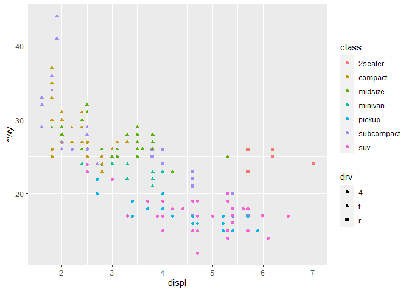<!-- -->

\*\*Observe that the aesthetics that I have used here are passed in the
aes function itself but not outside of the aes. If we want to control
the aesthetics using the variables of the data object itself, then we
must pass the aesthetics related arguments within the aes itself. We
will look into another example of bar plot below:

``` r
ggplot(data = mpg) + 
  geom_bar(mapping = aes(x = manufacturer, color = "blue")) # This is not the expected behavior 
```

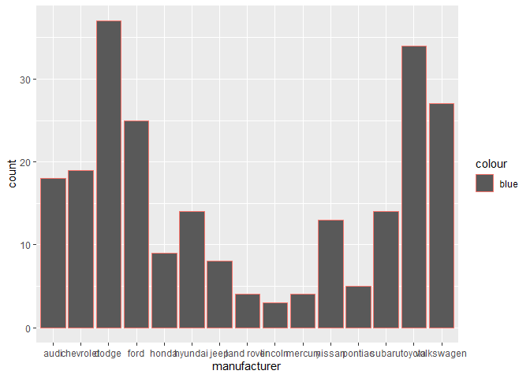<!-- -->

``` r
ggplot(data = mpg) + 
  geom_bar(mapping = aes(x = manufacturer), color = "blue") # The color is for the outline and fill is to fill inside 
```

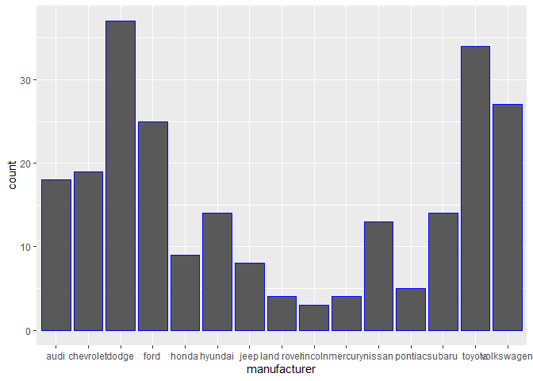<!-- -->

``` r
ggplot(data = mpg) + 
  geom_bar(mapping = aes(x = manufacturer), fill = "blue") # The color is for the outline and fill is to fill inside 
```

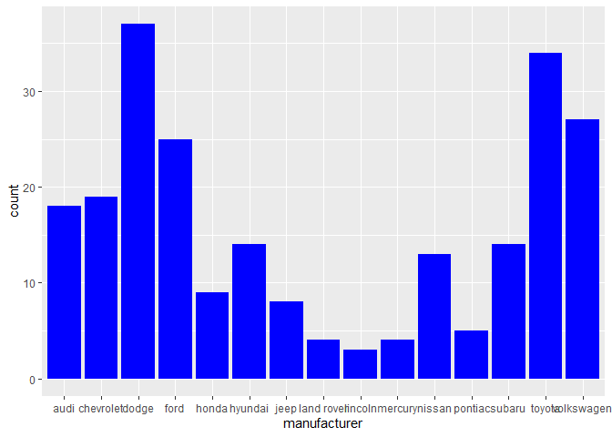<!-- -->

``` r
ggplot(data = mpg) + 
  geom_boxplot(mapping=aes(x=hwy), position = "dodge2", outlier.colour = "red") # The default statistics of geom_boxplot is statistics. It is embedded in the stat parameter
```

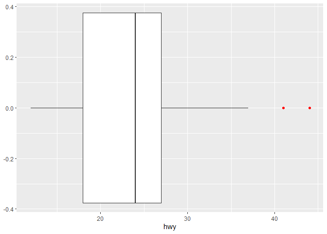<!-- -->

``` r
ggplot(data = mpg) +
  geom_bar(mapping = aes(x = class)) + 
  geom_text(aes(x = class, label = ..count..), stat = "count", color = "white", vjust = 1) 
```

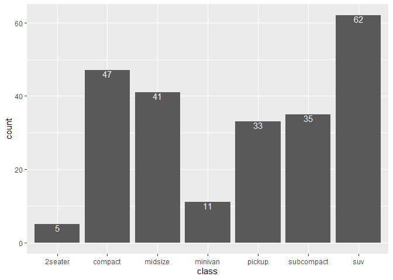<!-- -->
\### Scale controls the legends and axis \### Scale has three properties
controlled by three arguments, name, breaks, labels - Name is the title
of the respective axis or legend - There are various scale functions and
each function is makde up of multiple words separated by “\_” - 1st word
is scale, 2nd word is primary attribute color, shape, or x/y axis, and
the 3rd word is the name of the scale, such as continuous, discrete,
brewer

e.g., scale_colour_brewer() scale_x\_sqrt()

``` r
ggplot(data = mpg) +
  geom_point(mapping = aes(x = displ, y = hwy, 
                           color = class, 
                           shape = drv)) + 
  scale_x_continuous(name = "Using \"hwy\" variable for Gas Mileage") 
```

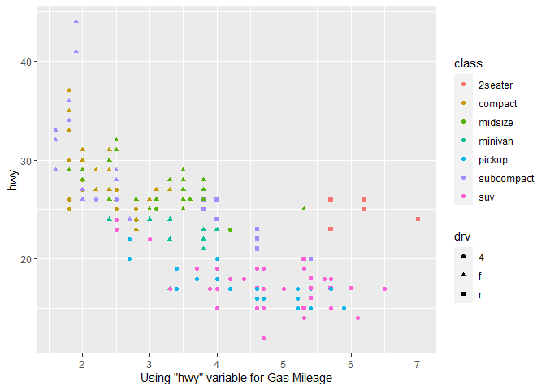<!-- -->

``` r
ggplot(data = mpg, mapping = aes(x = class)) +
  geom_bar(aes(fill=drv)) + 
  geom_text(aes(label = ..count..), stat = "count", color = "white", vjust = 1) +
  scale_fill_hue(h = c(180, 300))
```

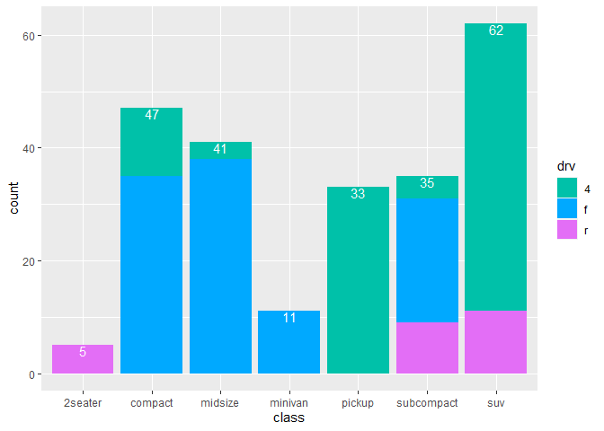<!-- -->

Lastly, let’s set the legend name. Legend here is used on a discreet
values and for this bar_plot, we will set a legend title as name =
“Legend for Drivetrain”

``` r
ggplot(data = mpg, mapping = aes(x = class)) +
  geom_bar(aes(fill=drv)) + 
  geom_text(aes(label = ..count..), stat = "count", color = "white", vjust = 1) +
  scale_fill_hue(h = c(180, 300), name = "Legend for Drivetrain")
```

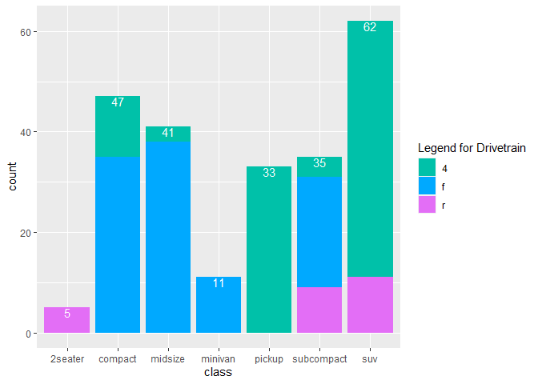<!-- -->

``` r
ggplot(data = mpg) +
  geom_point(mapping = aes(x = displ, y = hwy, 
                           color = class, 
                           shape = drv)) + 
  scale_x_continuous(name = "Using \"hwy\" variable for Gas Mileage") +
  scale_color_discrete(name = "My legend",
    limits = c("2seater", "compact", "midsize", "minivan", 
                                  "pickup", "subcompact", "suv"), 
    breaks = c("2seater", "compact", "midsize", "minivan", "pickup", "subcompact"
               , "suv"),
    labels = c("Two Seater", "Compact", "Mid-Size", "Minivan", "Pickup", 
               "Sub-Compact", "SUV"))
```

<!-- -->

``` r
ggplot(data = mpg) +
  geom_point(mapping = aes(x = displ, y = hwy, 
                           color = class, 
                           shape = drv)) + 
  lims(x = c(1,6), 
       y = c(10, 40))
```

    ## Warning: Removed 8 rows containing missing values (geom_point).

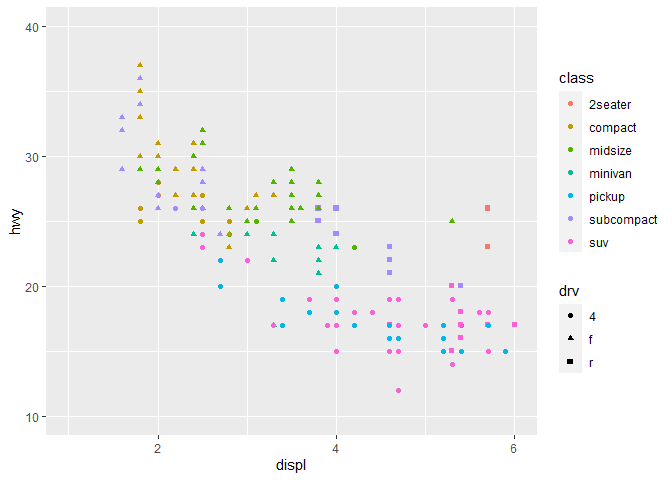<!-- -->

``` r
ggplot(data = mpg) +
  geom_point(mapping = aes(x = displ, y = hwy, 
                           color = class, 
                           shape = drv)) +
  facet_wrap(vars(manufacturer))
```

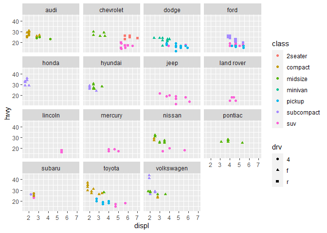<!-- -->

### Facets

facet_wrap(): “wraps” a 1d ribbon of panels into 2d. facet_grid() lays
out plots in a 2d grid

``` r
ggplot(data = mpg) +
  geom_point(mapping = aes(x = displ, y = hwy, 
                           color = class)) +
  facet_grid(.~drv)
```

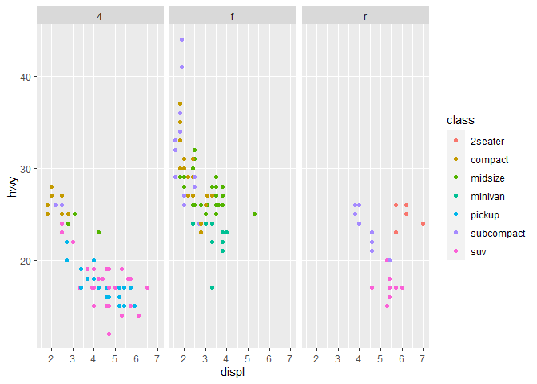<!-- -->

``` r
ggplot(data = mpg) +
  geom_point(mapping = aes(x = displ, y = hwy, 
                           color = class)) +
  facet_grid(drv ~.)
```

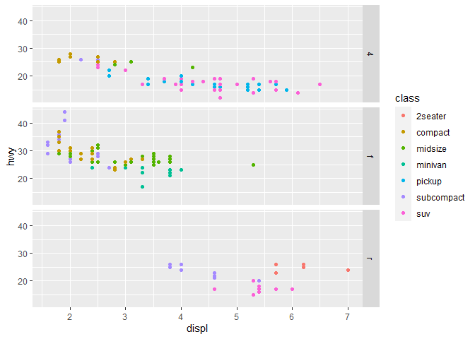<!-- -->

``` r
ggplot(data = mpg) +
  geom_point(mapping = aes(x = displ, y = hwy, 
                           color = class)) +
  facet_grid(drv ~ cyl)
```

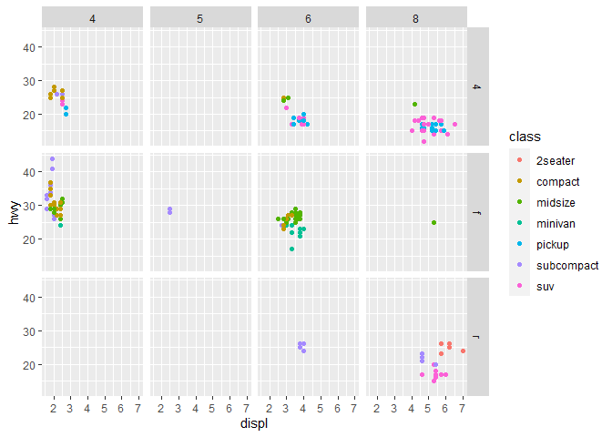<!-- -->

``` r
model <- lm(hwy~displ, mpg)
ggplot(mpg, aes(displ, hwy)) + 
  geom_abline(slope = model$coefficients[[2]], intercept = model$coefficients[[1]]) +
  facet_wrap(~cyl)
```

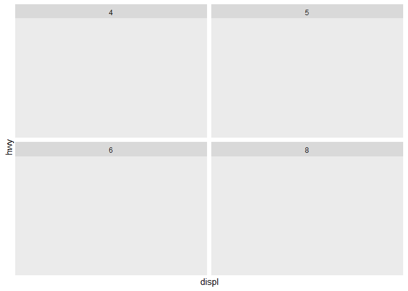<!-- -->

``` r
p <- ggplot(data = mpg) +
  geom_bar(mapping = aes(x = class, fill = drv), 
           color="black",
           linetype = 2,
           position="dodge")
print(p)
```

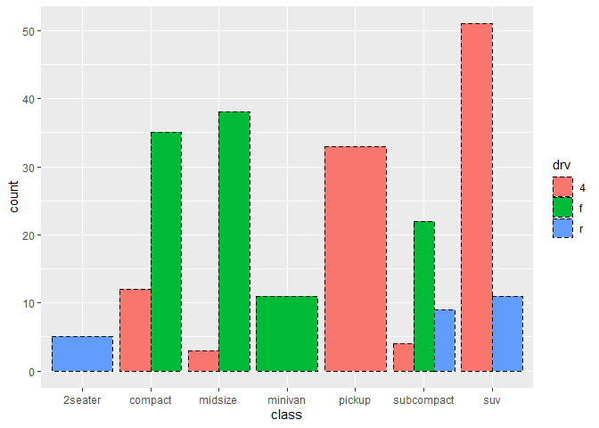<!-- -->

### Flip the coordinate

``` r
p + coord_flip()
```

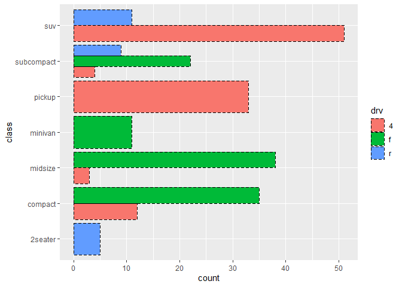<!-- -->

### Display the same graph on a polar coordinate system

``` r
ggplot(data = mpg) +
  geom_bar(mapping = aes(x = class, fill = drv), 
           color="black",
           linetype = 2) +
  coord_polar()
```

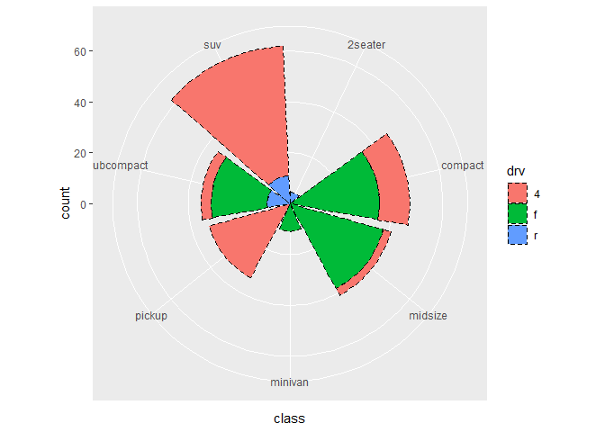<!-- -->
