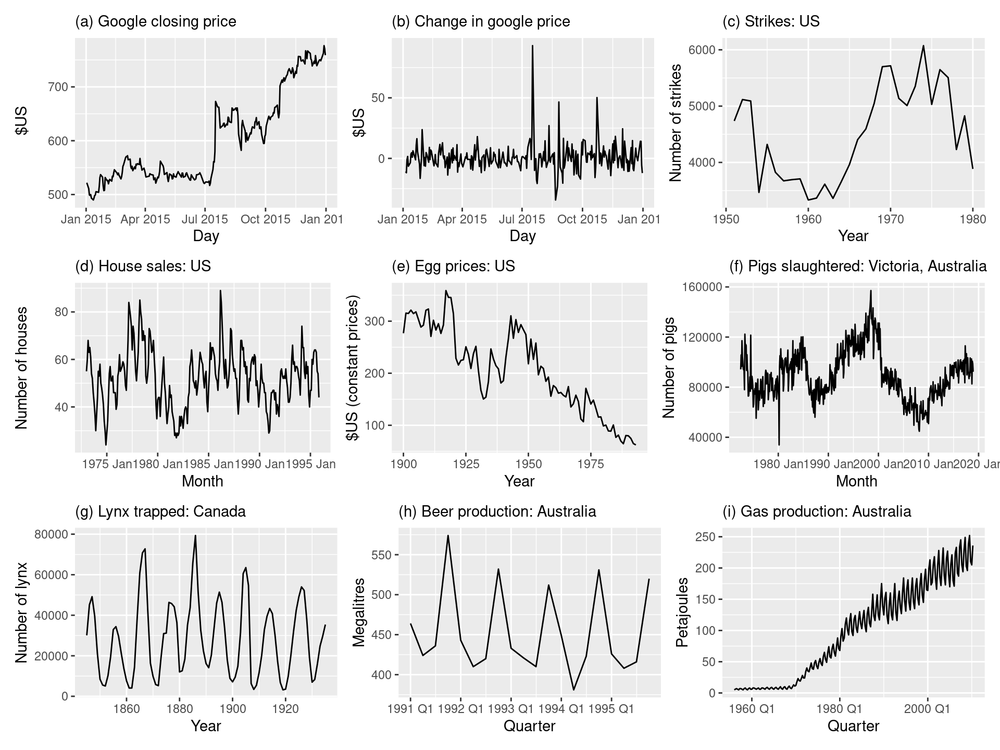

```{r setup, include=FALSE}
knitr::opts_chunk$set(echo = TRUE)
```

## Time Series Analysis. 
#### A collection of observations made over time, frequently at equal intervals, is referred to as a time series. The statistical test using moving averages and the correlations between the current values and the historical values can be used to predict future values. In a time series, there are only 2 variables: time and the variable we want to forecast.


Stationarity: - Consistency of distributions over windows of time. If a time series data exhibits a specific behavior over a period of time, there is a strong likelihood that it will exhibit the same behavior over a subsequent period of time, provided the time series is stationary. Accurate forecasting is made possible only when the data is stationary.

Which of these series are stationary? (a) Google closing stock price in 2015; (b) Daily change in the Google stock price in 2015; (c) Annual number of strikes in the US; (d) Monthly sales of new one-family houses sold in the US; (e) Annual price of a dozen eggs in the US (constant dollars); (f) Monthly total of pigs slaughtered in Victoria, Australia; (g) Annual total of Canadian Lynx furs traded by the Hudson Bay Company; (h) Quarterly Australian beer production; (i) Monthly Australian gas production.



Presence of Seasonality, Trend, and increasing or decreasing variance makes a time series data non-stationary.    

Source: Forecasting: Principles and Practice (3rd ed), Rob J Hyndman and George Athanasopoulos   

- ARIMA (Autoregressive integrated moving average) Non-seasonal models basically involve the estimation of an autoregressive model and a moving average, employed to estimate both the stochastic part and the underlying trend. 

Refer: [R Cookbook](https://rc2e.com/timeseriesanalysis)

There are other models to handle seasonal data similar to ARIMA.    
SARIMA : Seasonal ARIMA    
SARIMAX : Seasonal ARIMA with exogenous variables    


**Some important questions to first consider when first looking at a time series are:**

- Is there a trend, meaning that, on average, the measurements tend to increase (or decrease) over time?    
- Is there seasonality, meaning that there is a regularly repeating pattern of highs and lows related to calendar time such as seasons, quarters, months, days of the week, and so on?    
- Are there outliers? In regression, outliers are far away from your line. With time series data, your outliers are far away from your other data.     
- Is there a long-run cycle or period unrelated to seasonality factors?     
- Is there constant variance over time, or is the variance non-constant?     
- Are there any abrupt changes to either the level of the series or the variance?     

**Before starting to work on ARIMA model, explore time series functions**

## Time Series Data: 
- zoo and xts are excellent packages for working with time series data   
- They define a data structure for time series, and they contain many useful functions for working with time series data.   
- The xts implementation is a superset of zoo, so xts can do everything that zoo can do

```{r load-required-libraries}
library(xts)
library(zoo)
library(forecast) # To make time series forecasting 
library(quantmod) # To get the stock data 
library(ggplot2) # For plots 
library(readxl) # If required to read any excel data 
library(tseries) # Testing the stationarity assumptions and other diagnostics 
```


```{r converting_data_to_timeseries}
# Values for dates of first week of April, 2023-04-01 value is 3 and 2023-04-07 is 7 
x <- c(3, 4, 1, 4, 8, 5, 7)

# xts takes two arguments, here, x and dt. 
# x can be a vector, matrix, or data frame, and dt is a vector of corresponding dates or datetimes
# Create a dt vector with seven date values
dt <- seq(as.Date("2023-04-01"), as.Date("2023-04-07"), by = "days")
ts <- xts(x, dt)

```
- Extract the core data from the timeseries    
```{r extracting_coredata} 
coredata(ts)
```

- Test some timeseries functions on the timeseries object   

```{r timeseries_functions}
#' Uses calendar time stamps for extracting records 
# first (Extract first 2 days)
first(ts, "2 days")

# last (Just last record)
last(ts)

# Sub-setting using window function to extract 2nd, 3rd, and 4th observations 
window(ts, start = "2023-04-02", end = "2023-04-04")

# Type ts["2023-04"] to see what happens 
# We can extract the observations using the partial date match

ts["2023-04"]

# merge ts1 and ts2 
x <- c(3, 4, 1, 4, 8, 5, 7)
dt <- seq(as.Date("2023-04-01"), as.Date("2023-04-07"), by = "days")

# Create a time series ts1 using x and dt 
ts1 <- xts(x, dt)

x <- x + 3
dt <- seq(as.Date("2023-04-04"), as.Date("2023-04-10"), by = "days")
ts2 <- xts(x, dt)

# Combine or merge the two timeseries (multivariate time series data) into ts dataset
ts <- merge(ts1, ts2)

# Use na.locf (“last observation carried forward.”) on the merge dataset
ts <- na.locf(ts)

# Use na.spline from zoo package to fill smooth intermediate values from the known data 
ts <- merge(ts1, ts2)
ts <- na.spline(ts)

# Use lag to shift the base time by 2 intervals (Shift the data forward). Now the base time series has NA values
ts <- lag(ts, 2)
```


```{r exploratory_data_analysis of AirPassengers data}
AirPassengers
```


```{r Plot AirPassengers - ggplot}
ggplot(data = as.data.frame(AirPassengers)) + 
  geom_line(aes(x = seq(as.Date("1949-01-01"),
                        as.Date("1960-12-01"), by = "months"), 
                y = x # x is created by default from the .as.data.frame function
                )) + 
  labs(title = "International Air Passenger Traffic data per month in Thousands of passengers",
       x = "Dates between 1949 January to 1960 December", 
       y = "Monthly international air passenger traffic in Thousands")
```

- It is quite easy and simple to plot time series data using base plots
- plot() function is a generic function. 

plot syntax | purpose 
------------| ---------
plot(x, y) | Scatterplot of x and y numeric vectors  
plot(factor) | Barplot of the factor
plot(factor, y) | Boxplot of the numeric vector and the levels of the factor
plot(time_series) | Time series plot
plot(data_frame) | Correlation plot of all dataframe columns (more than two columns)
plot(date, y) | Plots a date-based vector
plot(function, lower, upper) | Plot of the function between the lower and maximum value specified


```{r Plot AirPassengers - base plot}
plot(AirPassengers, 
     xlab = "Dates between 1949 January to 1960 December",
     ylab = "Monthly international air passenger traffic in Thousands")

```

#### Time Series Analysis is about predicting an outcome based on the same data measured in the past time. 
- A “lag” is a fixed amount of passing time; One set of observations in a time series is plotted (lagged) against a second, later set of data. The kth lag is the time period that happened “k” time points before time i.     
- lag plots help to identify the presence of serial correlation (auto-correlation), outliers, randomness in the data, and seasonality.    

```{r lag-plot}
# Plot Y against four lags 
lag.plot(AirPassengers, lags = 4, 
         do.lines = F, 
         labels = F)
```


#### What is Auto Correlation? 
- Autocorrelation represents the degree of similarity between a given time series and a lagged version of itself over successive time intervals.   
- Y_t depends on the lags only making the equation: 

$$
Y_t = \alpha + \beta_1 Y_{t-1} + \beta_2 Y_{t-2} + ... + \beta_p Y_{t-p} + \epsilon_1 
$$
*Assumption:* errors are independently distributed with a normal distribution that has mean 0 and constant variance.


<p> One of the simplest ARIMA type models is a model in which we use a linear model to predict the value at the present time using the value at the previous time. This is called an AR(1) model, standing for autoregressive model of order 1. The order of the model indicates how many previous times we use to predict the present time. </p>

#### What is Moving Average part?

Moving averages model is the one where Y_t depends only on the lagged forecast errors. It is depicted by the following equation: 


$$
Y_t = \alpha + \epsilon_t + \phi_1\epsilon_{t-1} + \phi_2\epsilon_{t-2} + ... + \phi_q\epsilon_{t-q}  
$$

The errors (inputs in the MA part) are coming from the errors of AR part equation. (MA order q) part of (p, d, q)


```{r Auto-correlation Function ACF}
acf(AirPassengers)
```

- The required number of AR terms are identified using the Partial Autocorrelation (PACF) plot.  
- Partial autocorrelation can be thought as the correlation between the series and its lag, after excluding the contributions from the intermediate lags. So, PACF provides the pure correlation between a lag and the series.      

```{r Partial Auto-correlation Function PACF}
pacf(AirPassengers)
```

```{r auto arima model using non-transformed data}
model <- auto.arima(AirPassengers)
model
```

#### Understanding the output of ARIMA

- auto.arima has two parts. Non-seasonal and Seasonal parts of (p, d, q) & (P, D, Q) respectively.
- ARIMA	 (p,d,q)  --> This is the Non-Seasonal part of the ARIMA model     
- ARIMA (P, D, Q) m --> This is the Seasonla part of the ARIMA model with m being the observations per time-period in the seasonal component.    
- What about acf and pacf of residuals?    
Answer: The ARIMA model takes care of the auto-correlation component and moving averages forecast to estimate the coefficients. Therefore, the resulting residuals should not have any correlations in them.


```{r Run acf and pacf on residuals}
acf(model$residuals)
pacf(model$residuals)
```


#### Ljung-Box test on residuals to test the significance of Auto-correlation 
- Null hypothesis of the test is that there are no significant auto-correlations in the univariate time-series passed.    
- If the p-value is high enough, then it can be safely assumed that the model is good.   
- However, it is better to check the test on the fitted values as well. 
- If there is a discrepancy, it is recommended to perform post-hoc analysis using checkresiduals function.    

```{r Run Box.test}
Box.test(model$residuals)
```


#### Draw a histogram of residuals. 
- The residuals should be normally distributed after a good model fitting   

```{r histogram of residuals}
hist(model$residuals)
```

#### There is a better version to check the residuals, using checkresiduals() 
- The overall p-value of the "Ljung-Box" test should be high such that there are no significant correlations.    
```{r checkresiduals model1}
checkresiduals(model)
```

- However, looking at the p-value, there is still pattern in the residuals and hence further transformation is required.   
- We will be doing a log transformation on the AirPassengers data now. 
- Then, fit the auto-arima to see the residuals have any correlations    
- From the results, the p-value is high, confirming the null hypothesis that there are no significant correlations in the residuals   

```{r log-transform AirPassenger and fir auto-arima}
AirPassengers <- log(AirPassengers)
model <- auto.arima(AirPassengers)
checkresiduals(model)
```

#### If everything is looking good, make prediction using forecast function. 
```{r make predictions using forecast and plot the predictions}
prediction <- forecast(model, 10)
plot(prediction)
```

# Analyze stock data

```{r get_AAPL_Stock_Data}
getSymbols("AAPL", 
           from = "2021-01-01",
           to = "2023-03-31")
chartSeries(AAPL)
```


#### Extract the closing stock price 
```{r extract_close_price}
stock_close_price <- AAPL$AAPL.Close
```


#### Fit auto.arima
```{r auto-arima stock data}
model <- auto.arima(stock_close_price)
summary(model)
```


```{r check model residuals}
acf(model$residuals)
pacf(model$residuals)
checkresiduals(model)
```


```{r predict_stock_price} 
prediction <- forecast(model, 10)
```


```{r plot the predicted data}
plot(prediction)
```

